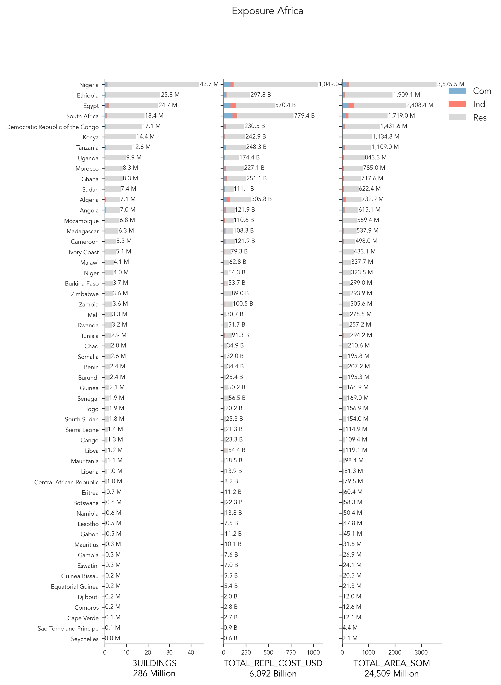
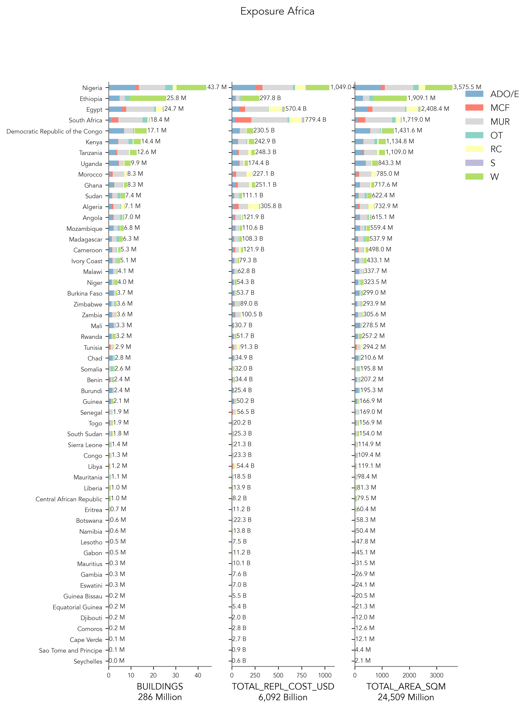

# Africa

## Mapping schemes

Please refer to the public repository: [https://github.com/nicolepaul/africa-exposure-model](https://github.com/nicolepaul/africa-exposure-model)

## Metadata
|     | ID_0   | NAME_0                           | OCCUPANCY   | DATA_SOURCES                                                                                                                     | DATA_YEAR   |   ADM_LEVEL | VARIABLES      | NOTES                                                                                                                      |
|----:|:-------|:---------------------------------|:------------|:---------------------------------------------------------------------------------------------------------------------------------|:------------|------------:|:---------------|:---------------------------------------------------------------------------------------------------------------------------|
|   0 | BDI    | Burundi                          | RES         | Population and Housing Census, 2008                                                                                              | 2008        |           1 | Wall materials | Population based on United Nations World Population Prospects (rev 2019) and WorldPop (2020) at Adm1                       |
|   1 | CAF    | Central_African_Republic         | RES         | nan                                                                                                                              | nan         |           1 | nan            | Population based on United Nations World Population Prospects (rev 2019) and WorldPop (2020) at Adm1                       |
|   2 | CMR    | Cameroon                         | RES         | Population and Housing Census, 2010                                                                                              | 2010        |           1 | Wall materials | Population based on United Nations World Population Prospects (rev 2019) and WorldPop (2020) at Adm1                       |
|   3 | COD    | Democratic_Republic_of_the_Congo | RES         | nan                                                                                                                              | nan         |           1 | nan            | Population based on United Nations World Population Prospects (rev 2019) and WorldPop (2020) at Adm1                       |
|   4 | COG    | Congo                            | RES         | nan                                                                                                                              | nan         |           1 | nan            | Population based on United Nations World Population Prospects (rev 2019) and WorldPop (2020) at Adm1                       |
|   5 | GAB    | Gabon                            | RES         | General Population and Housing Census of Gabon, 2013                                                                             | 2013        |           1 | nan            | Population based on United Nations World Population Prospects (rev 2019) and WorldPop (2020) at Adm1                       |
|   6 | GNQ    | Equatorial_Guinea                | RES         | General Census of Population and Housing, 2002                                                                                   | 2002        |           1 | nan            | Population based on United Nations World Population Prospects (rev 2019) and WorldPop (2020) at Adm1                       |
|   7 | STP    | Sao_Tome_and_Principe            | RES         | nan                                                                                                                              | nan         |           1 | nan            | Population based on United Nations World Population Prospects (rev 2019) and WorldPop (2020) at Adm1                       |
|   8 | TCD    | Chad                             | RES         | Demographic and Health Survey, 2015                                                                                              | 2015        |           1 | Wall materials | Population based on United Nations World Population Prospects (rev 2019) and WorldPop (2020) at Adm1                       |
|   9 | COM    | Comoros                          | RES         | nan                                                                                                                              | nan         |           1 | nan            | Population based on United Nations World Population Prospects (rev 2019) and WorldPop (2020) at Adm1                       |
|  10 | DJI    | Djibouti                         | RES         | Annual Statistics, 2012                                                                                                          | 2012        |           1 | Wall materials | Population based on United Nations World Population Prospects (rev 2019) and WorldPop (2020) at Adm1                       |
|  11 | ERI    | Eritrea                          | RES         | Population and Health Survey, 2010                                                                                               | 2010        |           1 | Wall materials | Population based on United Nations World Population Prospects (rev 2019) and WorldPop (2020) at Adm1                       |
|  12 | ETH    | Ethiopia                         | RES         | National Population Census, 2007                                                                                                 | 2007        |           1 | Wall materials | Population based on United Nations World Population Prospects (rev 2019) and WorldPop (2020) at Adm1                       |
|     |        |                                  |             |                                                                                                                                  |             |             |                | Finer admin level data available                                                                                           |
|  13 | KEN    | Kenya                            | RES         | Population and Housing Census, 2019                                                                                              | 2019        |           1 | Wall materials | Population based on United Nations World Population Prospects (rev 2019) and WorldPop (2020) at Adm1                       |
|  14 | MDG    | Madagascar                       | RES         | nan                                                                                                                              | nan         |           1 | nan            | Population based on United Nations World Population Prospects (rev 2019) and WorldPop (2020) at Adm1                       |
|  15 | MUS    | Mauritius                        | RES         | Population and Housing Census, 2013                                                                                              | 2013        |           1 | Wall materials | Population based on United Nations World Population Prospects (rev 2019) and WorldPop (2020) at Adm1                       |
|  16 | RWA    | Rwanda                           | RES         | Census of Households and Housing, 2012                                                                                           | 2012        |           1 | Wall materials | Population based on United Nations World Population Prospects (rev 2019) and WorldPop (2020) at Adm1                       |
|  17 | SDN    | Sudan                            | RES         | Sudan Population and Housing Census, 2008                                                                                        | 2008        |           1 | nan            | Population based on United Nations World Population Prospects (rev 2019) and WorldPop (2020) at Adm1                       |
|  18 | SOM    | Somalia                          | RES         | UNFP Housing and Household Assets of the Somali People, 2016                                                                     | 2016        |           1 | Wall materials | Population based on United Nations World Population Prospects (rev 2019) and WorldPop (2020) at Adm1                       |
|  19 | SSD    | South_Sudan                      | RES         | Sudan Population and Housing Census, 2008                                                                                        | 2008        |           1 | nan            | Population based on United Nations World Population Prospects (rev 2019) and WorldPop (2020) at Adm1                       |
|  20 | SYC    | Seychelle                        | RES         | nan                                                                                                                              | nan         |           1 | nan            | Population based on United Nations World Population Prospects (rev 2019) and WorldPop (2020) at Adm1                       |
|  21 | TZA    | Tanzania                         | RES         | Population and Housing Census, 2012                                                                                              | 2012        |           1 | Wall materials | Population based on United Nations World Population Prospects (rev 2019) and WorldPop (2020) at Adm1                       |
|  22 | UGA    | Uganda                           | RES         | National Housing Survey, 2016                                                                                                    | 2016        |           1 | Wall materials | Population based on United Nations World Population Prospects (rev 2019) and WorldPop (2020) at Adm1                       |
|  23 | DZA    | Algeria                          | RES         | Population and Housing Census, 2008                                                                                              | 2008        |           1 | nan            | Population based on United Nations World Population Prospects (rev 2019) and WorldPop (2020) at Adm1                       |
|  24 | ESH    | Western_Sahara                   | RES         | Morocco Population and Housing Census, 2014                                                                                      | 2014        |           1 | nan            | Population based on United Nations World Population Prospects (rev 2019) and WorldPop (2020) at Adm1                       |
|  25 | EGY    | Egypt                            | RES         | Census, 2017                                                                                                                     | 2017        |           1 | nan            | Population based on United Nations World Population Prospects (rev 2019) and WorldPop (2020) at Adm1                       |
|     |        |                                  |             |                                                                                                                                  |             |             |                | Finer admin level data available                                                                                           |
|  26 | LBY    | Libya                            | RES         | Population and Living Conditions of Libya, 2006                                                                                  | 2006        |           1 | nan            | Population based on United Nations World Population Prospects (rev 2019) and WorldPop (2020) at Adm1                       |
|  27 | MAR    | Morocco                          | RES         | Morocco Population and Housing Census, 2014                                                                                      | 2014        |           1 | Wall materials | Population based on United Nations World Population Prospects (rev 2019) and WorldPop (2020) at Adm1                       |
|  28 | MRT    | Mauritania                       | RES         | General Population and Housing Census, 2013                                                                                      | 2013        |           1 | Wall materials | Population based on United Nations World Population Prospects (rev 2019) and WorldPop (2020) at Adm1                       |
|  29 | TUN    | Tunisia                          | RES         | Population and Housing Census, 2014                                                                                              | 2014        |           1 | nan            | Population based on United Nations World Population Prospects (rev 2019) and WorldPop (2020) at Adm1                       |
|  30 | AGO    | Angola                           | RES         | Population and Housing Census, 2014                                                                                              | 2014        |           1 | nan            | Population based on United Nations World Population Prospects (rev 2019) and WorldPop (2020) at Adm1                       |
|  31 | BWA    | Botswana                         | RES         | Population and Housing Census, 2011                                                                                              | 2011        |           1 | Wall materials | Population based on United Nations World Population Prospects (rev 2019) and WorldPop (2020) at Adm1                       |
|  32 | LSO    | Lesotho                          | RES         | Population and Housing Census, 2006                                                                                              | 2006        |           1 | Wall materials | Population based on United Nations World Population Prospects (rev 2019) and WorldPop (2020) at Adm1                       |
|  33 | MOZ    | Mozambique                       | RES         | Census, 2017                                                                                                                     | 2017        |           1 | Wall materials | Population based on United Nations World Population Prospects (rev 2019) and WorldPop (2020) at Adm1                       |
|  34 | MWI    | Malawi                           | RES         | Population and Housing Census, 2018                                                                                              | 2018        |           1 | Wall materials | Population based on United Nations World Population Prospects (rev 2019) and WorldPop (2020) at Adm1                       |
|  35 | NAM    | Namibia                          | RES         | Population and Housing Census, 2011                                                                                              | 2011        |           1 | Wall materials | Population based on United Nations World Population Prospects (rev 2019) and WorldPop (2020) at Adm1                       |
|  36 | SWZ    | Eswatini                         | RES         | nan                                                                                                                              | nan         |           1 | nan            | Population based on United Nations World Population Prospects (rev 2019) and WorldPop (2020) at Adm1                       |
|  37 | ZAF    | South_Africa                     | RES         | General Household Survey, 2019                                                                                                   | 2019        |           1 | Wall materials | Population based on United Nations World Population Prospects (rev 2019) and WorldPop (2020) at Adm1                       |
|  38 | ZMB    | Zambia                           | RES         | Population and Housing Census, 2010                                                                                              | 2010        |           1 | Wall materials | Population based on United Nations World Population Prospects (rev 2019) and WorldPop (2020) at Adm1                       |
|  39 | ZWE    | Zimbabwe                         | RES         | Inter-censal Survey, 2017                                                                                                        | 2017        |           1 | nan            | Population based on United Nations World Population Prospects (rev 2019) and WorldPop (2020) at Adm1                       |
|  40 | BEN    | Benin                            | RES         | nan                                                                                                                              | nan         |           1 | nan            | Population based on United Nations World Population Prospects (rev 2019) and WorldPop (2020) at Adm1                       |
|  41 | BFA    | Burkina_Faso                     | RES         | Analysis of Living Conditions, 2007                                                                                              | 2007        |           1 | Wall materials | Population based on United Nations World Population Prospects (rev 2019) and WorldPop (2020) at Adm1                       |
|  42 | CIV    | Ivory_Coast                      | RES         | nan                                                                                                                              | nan         |           1 | nan            | Population based on United Nations World Population Prospects (rev 2019) and WorldPop (2020) at Adm1                       |
|  43 | CPV    | Cape_Verde                       | RES         | Population and Housing Census, 2010                                                                                              | 2010        |           1 | nan            | Population based on United Nations World Population Prospects (rev 2019) and WorldPop (2020) at Adm1                       |
|  44 | GHA    | Ghana                            | RES         | Population and Housing Census, 2010                                                                                              | 2010        |           1 | Wall materials | Population based on United Nations World Population Prospects (rev 2019) and WorldPop (2020) at Adm1                       |
|  45 | GIN    | Guinea                           | RES         | EIBC 2013                                                                                                                        | 2013        |           1 | Wall materials | Population based on United Nations World Population Prospects (rev 2019) and WorldPop (2020) at Adm1                       |
|  46 | GMB    | Gambia                           | RES         | Population and Housing Census, 2013                                                                                              | 2013        |           1 | Wall materials | Population based on United Nations World Population Prospects (rev 2019) and WorldPop (2020) at Adm1                       |
|  47 | GNB    | Guinea_Bissau                    | RES         | nan                                                                                                                              | nan         |           1 | nan            | Population based on United Nations World Population Prospects (rev 2019) and WorldPop (2020) at Adm1                       |
|  48 | LBR    | Liberia                          | RES         | Population and Housing Census, 2008                                                                                              | 2008        |           1 | Wall materials | Population based on United Nations World Population Prospects (rev 2019) and WorldPop (2020) at Adm1                       |
|  49 | MLI    | Mali                             | RES         | Population and Housing Census, 2011                                                                                              | 2011        |           1 | Wall materials | Population based on United Nations World Population Prospects (rev 2019) and WorldPop (2020) at Adm1                       |
|  50 | NER    | Niger                            | RES         | Population and Housing Census, 2012                                                                                              | 2012        |           1 | nan            | Population based on United Nations World Population Prospects (rev 2019) and WorldPop (2020) at Adm1                       |
|  51 | NGA    | Nigeria                          | RES         | Population and Housing Census, 2006                                                                                              | 2006        |           1 | Wall materials | Population based on United Nations World Population Prospects (rev 2019) and WorldPop (2020) at Adm1                       |
|     |        |                                  |             |                                                                                                                                  |             |             |                | Finer admin level data available                                                                                           |
|  52 | SEN    | Senegal                          | RES         | General Census of Population and Housing, Agriculture and Livestock (RGPHAE), 2013                                               | 2013        |           1 | Wall materials | Population based on United Nations World Population Prospects (rev 2019) and WorldPop (2020) at Adm1                       |
|  53 | SLE    | Sierra_Leone                     | RES         | Integrated Household Survey, 2011                                                                                                | 2011        |           1 | Wall materials | Population based on United Nations World Population Prospects (rev 2019) and WorldPop (2020) at Adm1                       |
|  54 | TGO    | Togo                             | RES         | nan                                                                                                                              | nan         |           1 | nan            | Population based on United Nations World Population Prospects (rev 2019) and WorldPop (2020) at Adm1                       |
|  55 | BDI    | Burundi                          | IND, COM    | nan                                                                                                                              | nan         |           0 | nan            | While available nonresidential data was investigated for Africa, International Labour Organization (ILO) for 2019 was used |
|  56 | CAF    | Central_African_Republic         | IND, COM    | nan                                                                                                                              | nan         |           0 | nan            | While available nonresidential data was investigated for Africa, International Labour Organization (ILO) for 2019 was used |
|  57 | CMR    | Cameroon                         | IND, COM    | Banque des Données Economiques et Financières, 2017; Second Report on Employment and the Informal Sector, 2012                   | 2017        |           0 | nan            | While available nonresidential data was investigated for Africa, International Labour Organization (ILO) for 2019 was used |
|  58 | COD    | Democratic_Republic_of_the_Congo | IND, COM    | nan                                                                                                                              | nan         |           0 | nan            | While available nonresidential data was investigated for Africa, International Labour Organization (ILO) for 2019 was used |
|  59 | COG    | Congo                            | IND, COM    | nan                                                                                                                              | nan         |           0 | nan            | While available nonresidential data was investigated for Africa, International Labour Organization (ILO) for 2019 was used |
|  60 | GAB    | Gabon                            | IND, COM    | Statistical Yearbook, 2009                                                                                                       | 2009        |           0 | nan            | While available nonresidential data was investigated for Africa, International Labour Organization (ILO) for 2019 was used |
|  61 | GNQ    | Equatorial_Guinea                | IND, COM    | nan                                                                                                                              | nan         |           0 | nan            | While available nonresidential data was investigated for Africa, International Labour Organization (ILO) for 2019 was used |
|  62 | STP    | Sao_Tome_and_Principe            | IND, COM    | Company Activities, 2010-14                                                                                                      | 2014        |           0 | nan            | While available nonresidential data was investigated for Africa, International Labour Organization (ILO) for 2019 was used |
|  63 | TCD    | Chad                             | IND, COM    | nan                                                                                                                              | nan         |           0 | nan            | While available nonresidential data was investigated for Africa, International Labour Organization (ILO) for 2019 was used |
|  64 | COM    | Comoros                          | IND, COM    | nan                                                                                                                              | nan         |           0 | nan            | While available nonresidential data was investigated for Africa, International Labour Organization (ILO) for 2019 was used |
|  65 | DJI    | Djibouti                         | IND, COM    | nan                                                                                                                              | nan         |           0 | nan            | While available nonresidential data was investigated for Africa, International Labour Organization (ILO) for 2019 was used |
|  66 | ERI    | Eritrea                          | IND, COM    | nan                                                                                                                              | nan         |           0 | nan            | While available nonresidential data was investigated for Africa, International Labour Organization (ILO) for 2019 was used |
|  67 | ETH    | Ethiopia                         | IND, COM    | Labour Force Survey, 2013                                                                                                        | 2013        |           0 | nan            | While available nonresidential data was investigated for Africa, International Labour Organization (ILO) for 2019 was used |
|  68 | KEN    | Kenya                            | IND, COM    | Census of Establishments, 2017; Quarterly Labour Force Report, 2019/Q1                                                           | 2019        |           0 | nan            | While available nonresidential data was investigated for Africa, International Labour Organization (ILO) for 2019 was used |
|  69 | MDG    | Madagascar                       | IND, COM    | National Survey on Employment and the Informal Sector, 2012                                                                      | 2012        |           0 | nan            | While available nonresidential data was investigated for Africa, International Labour Organization (ILO) for 2019 was used |
|  70 | MUS    | Mauritius                        | IND, COM    | Labour force, employment, and underemployment, 2016/Q1                                                                           | 2016        |           0 | nan            | While available nonresidential data was investigated for Africa, International Labour Organization (ILO) for 2019 was used |
|  71 | RWA    | Rwanda                           | IND, COM    | Labor Force Survey, 2011                                                                                                         | 2011        |           0 | nan            | While available nonresidential data was investigated for Africa, International Labour Organization (ILO) for 2019 was used |
|  72 | SDN    | Sudan                            | IND, COM    | Labor Force Survey, 2011                                                                                                         | 2011        |           0 | nan            | While available nonresidential data was investigated for Africa, International Labour Organization (ILO) for 2019 was used |
|  73 | SOM    | Somalia                          | IND, COM    | nan                                                                                                                              | nan         |           0 | nan            | While available nonresidential data was investigated for Africa, International Labour Organization (ILO) for 2019 was used |
|  74 | SSD    | South_Sudan                      | IND, COM    | nan                                                                                                                              | nan         |           0 | nan            | While available nonresidential data was investigated for Africa, International Labour Organization (ILO) for 2019 was used |
|  75 | SYC    | Seychelle                        | IND, COM    | nan                                                                                                                              | nan         |           0 | nan            | While available nonresidential data was investigated for Africa, International Labour Organization (ILO) for 2019 was used |
|  76 | TZA    | Tanzania                         | IND, COM    | Employment Estimates Brochure, 2018                                                                                              | 2018        |           0 | nan            | While available nonresidential data was investigated for Africa, International Labour Organization (ILO) for 2019 was used |
|  77 | UGA    | Uganda                           | IND, COM    | Annual Business Inquiry Report, 2010                                                                                             | 2010        |           0 | nan            | While available nonresidential data was investigated for Africa, International Labour Organization (ILO) for 2019 was used |
|  78 | DZA    | Algeria                          | IND, COM    | Employment Survey with Households, 2014                                                                                          | 2014        |           0 | nan            | While available nonresidential data was investigated for Africa, International Labour Organization (ILO) for 2019 was used |
|  79 | ESH    | Western_Sahara                   | IND, COM    | nan                                                                                                                              | nan         |           0 | nan            | While available nonresidential data was investigated for Africa, International Labour Organization (ILO) for 2019 was used |
|  80 | EGY    | Egypt                            | IND, COM    | Work Census, 2017                                                                                                                | 2017        |           0 | nan            | While available nonresidential data was investigated for Africa, International Labour Organization (ILO) for 2019 was used |
|  81 | LBY    | Libya                            | IND, COM    | Population and Living Conditions of Libya, 2006                                                                                  | 2006        |           0 | nan            | While available nonresidential data was investigated for Africa, International Labour Organization (ILO) for 2019 was used |
|  82 | MAR    | Morocco                          | IND, COM    | Activity, employment, and underemployment report, 2020/Q4                                                                        | 0/Q4        |           0 | nan            | While available nonresidential data was investigated for Africa, International Labour Organization (ILO) for 2019 was used |
|  83 | MRT    | Mauritania                       | IND, COM    | nan                                                                                                                              | nan         |           0 | nan            | While available nonresidential data was investigated for Africa, International Labour Organization (ILO) for 2019 was used |
|  84 | TUN    | Tunisia                          | IND, COM    | National Employment Survey, 2016                                                                                                 | 2016        |           0 | nan            | While available nonresidential data was investigated for Africa, International Labour Organization (ILO) for 2019 was used |
|  85 | AGO    | Angola                           | IND, COM    | nan                                                                                                                              | nan         |           0 | nan            | While available nonresidential data was investigated for Africa, International Labour Organization (ILO) for 2019 was used |
|  86 | BWA    | Botswana                         | IND, COM    | Labour Force Survey Report, 2005/6                                                                                               | 06-May      |           0 | nan            | While available nonresidential data was investigated for Africa, International Labour Organization (ILO) for 2019 was used |
|  87 | LSO    | Lesotho                          | IND, COM    | nan                                                                                                                              | nan         |           0 | nan            | While available nonresidential data was investigated for Africa, International Labour Organization (ILO) for 2019 was used |
|  88 | MOZ    | Mozambique                       | IND, COM    | Census of Comparies, 2014-15; Statistical Yearbook, 2018                                                                         | 2018        |           0 | nan            | While available nonresidential data was investigated for Africa, International Labour Organization (ILO) for 2019 was used |
|  89 | MWI    | Malawi                           | IND, COM    | Labour Force Survey Report, 2013                                                                                                 | 2013        |           0 | nan            | While available nonresidential data was investigated for Africa, International Labour Organization (ILO) for 2019 was used |
|  90 | NAM    | Namibia                          | IND, COM    | Labour Force Survey Report, 2018                                                                                                 | 2018        |           0 | nan            | While available nonresidential data was investigated for Africa, International Labour Organization (ILO) for 2019 was used |
|  91 | SWZ    | Eswatini                         | IND, COM    | Integrated Labour Force Survey, 2010                                                                                             | 2010        |           0 | nan            | While available nonresidential data was investigated for Africa, International Labour Organization (ILO) for 2019 was used |
|  92 | ZAF    | South_Africa                     | IND, COM    | Quarterly Labour Force Survey, 2019                                                                                              | 2019        |           0 | nan            | While available nonresidential data was investigated for Africa, International Labour Organization (ILO) for 2019 was used |
|  93 | ZMB    | Zambia                           | IND, COM    | Labour Force Survey Report, 2012                                                                                                 | 2012        |           0 | nan            | While available nonresidential data was investigated for Africa, International Labour Organization (ILO) for 2019 was used |
|  94 | ZWE    | Zimbabwe                         | IND, COM    | Labour Force Survey Report, 2014                                                                                                 | 2014        |           0 | nan            | While available nonresidential data was investigated for Africa, International Labour Organization (ILO) for 2019 was used |
|  95 | BEN    | Benin                            | IND, COM    | Regional Integrated Survey on Employment and the Informal Sector (ERI-ESI), 2018                                                 | 2018        |           0 | nan            | While available nonresidential data was investigated for Africa, International Labour Organization (ILO) for 2019 was used |
|  96 | BFA    | Burkina_Faso                     | IND, COM    | Analysis of the results of the annual survey on household living conditions and poverty monitoring in Burkina Faso, EAQUIB, 2007 | 2007        |           0 | nan            | While available nonresidential data was investigated for Africa, International Labour Organization (ILO) for 2019 was used |
|  97 | CIV    | Ivory_Coast                      | IND, COM    | nan                                                                                                                              | nan         |           0 | nan            | While available nonresidential data was investigated for Africa, International Labour Organization (ILO) for 2019 was used |
|  98 | CPV    | Cape_Verde                       | IND, COM    | nan                                                                                                                              | nan         |           0 | nan            | While available nonresidential data was investigated for Africa, International Labour Organization (ILO) for 2019 was used |
|  99 | GHA    | Ghana                            | IND, COM    | Integrated Business Enterprise Survey, 2015                                                                                      | 2015        |           0 | nan            | While available nonresidential data was investigated for Africa, International Labour Organization (ILO) for 2019 was used |
| 100 | GIN    | Guinea                           | IND, COM    | General Population and Housing Census, 2014                                                                                      | 2014        |           0 | nan            | While available nonresidential data was investigated for Africa, International Labour Organization (ILO) for 2019 was used |
| 101 | GMB    | Gambia                           | IND, COM    | Gambia Labour Force Survey Report, 2012; Economic Census, 2015                                                                   | 2015        |           0 | nan            | While available nonresidential data was investigated for Africa, International Labour Organization (ILO) for 2019 was used |
| 102 | GNB    | Guinea_Bissau                    | IND, COM    | nan                                                                                                                              | nan         |           0 | nan            | While available nonresidential data was investigated for Africa, International Labour Organization (ILO) for 2019 was used |
| 103 | LBR    | Liberia                          | IND, COM    | Labour Force Survey Report, 2010                                                                                                 | 2010        |           0 | nan            | While available nonresidential data was investigated for Africa, International Labour Organization (ILO) for 2019 was used |
| 104 | MLI    | Mali                             | IND, COM    | Regional Integrated Survey on Employment and the Informal Sector, 2019                                                           | 2019        |           0 | nan            | While available nonresidential data was investigated for Africa, International Labour Organization (ILO) for 2019 was used |
| 105 | NER    | Niger                            | IND, COM    | nan                                                                                                                              | nan         |           0 | nan            | While available nonresidential data was investigated for Africa, International Labour Organization (ILO) for 2019 was used |
| 106 | NGA    | Nigeria                          | IND, COM    | Presentation of Labour Statistics , 2015                                                                                         | 2015        |           0 | nan            | While available nonresidential data was investigated for Africa, International Labour Organization (ILO) for 2019 was used |
| 107 | SEN    | Senegal                          | IND, COM    | Integrated survey of Employment and Informal Sector, 2017                                                                        | 2017        |           0 | nan            | While available nonresidential data was investigated for Africa, International Labour Organization (ILO) for 2019 was used |
| 108 | SLE    | Sierra_Leone                     | IND, COM    | Labour Force Survey Report, 2014                                                                                                 | 2014        |           0 | nan            | While available nonresidential data was investigated for Africa, International Labour Organization (ILO) for 2019 was used |
| 109 | TGO    | Togo                             | IND, COM    | nan                                                                                                                              | nan         |           0 | nan            | While available nonresidential data was investigated for Africa, International Labour Organization (ILO) for 2019 was used |

    