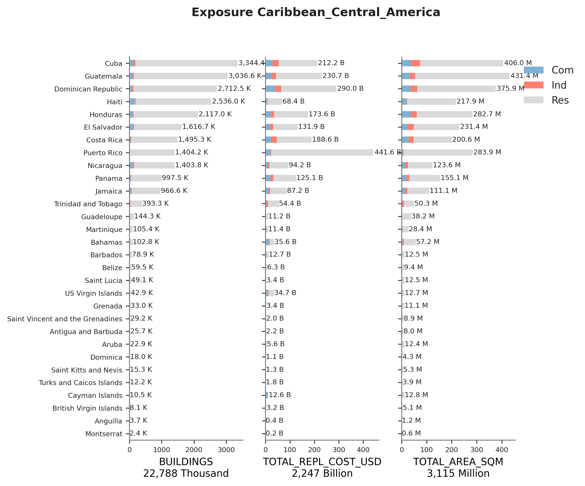
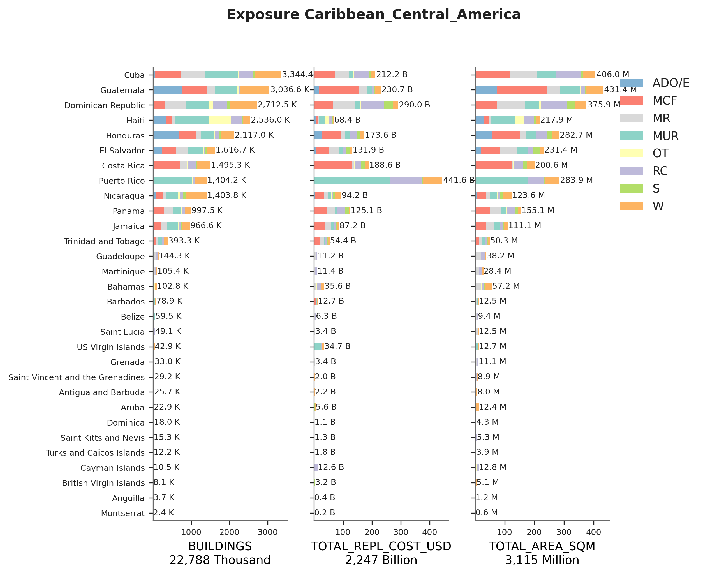

# Caribbean_Central_America

## Metadata
|    | ID_0   | NAME_0                           | OCCUPANCY     | DATA_SOURCES                                                     | PUBLISHER                                       |   DATA_YEAR |   ADM_LEVEL | VARIABLES                                   |   AVAILABLE_UPDATES | LINKS                                               |
|---:|:-------|:---------------------------------|:--------------|:-----------------------------------------------------------------|:------------------------------------------------|------------:|------------:|:--------------------------------------------|--------------------:|:----------------------------------------------------|
|  0 | ATG    | Antigua and Barbuda              | RES, IND, COM | GED4GEM                                                          | Global Earthquake Model Foundation              |        2015 |           1 | Building construction material              |                 nan | https://platform.openquake.org/                     |
|    |        |                                  |               |                                                                  |                                                 |             |             | Building formality                          |                     |                                                     |
|    |        |                                  |               |                                                                  |                                                 |             |             | Bulding height range                        |                     |                                                     |
|  1 | BHS    | Bahamas                          | RES, IND, COM | GED4GEM                                                          | Global Earthquake Model Foundation              |        2015 |           1 | Building construction material              |                 nan | https://platform.openquake.org/                     |
|    |        |                                  |               |                                                                  |                                                 |             |             | Building formality                          |                     |                                                     |
|    |        |                                  |               |                                                                  |                                                 |             |             | Bulding height range                        |                     |                                                     |
|  2 | DMA    | Dominica                         | RES, IND, COM | GED4GEM                                                          | Global Earthquake Model Foundation              |        2015 |           1 | Building construction material              |                 nan | https://platform.openquake.org/                     |
|    |        |                                  |               |                                                                  |                                                 |             |             | Building formality                          |                     |                                                     |
|    |        |                                  |               |                                                                  |                                                 |             |             | Bulding height range                        |                     |                                                     |
|  3 | GRD    | Grenada                          | RES, IND, COM | GED4GEM                                                          | Global Earthquake Model Foundation              |        2015 |           1 | Building construction material              |                 nan | https://platform.openquake.org/                     |
|    |        |                                  |               |                                                                  |                                                 |             |             | Building formality                          |                     |                                                     |
|    |        |                                  |               |                                                                  |                                                 |             |             | Bulding height range                        |                     |                                                     |
|  4 | KNA    | Saint Kitts and Nevis            | RES, IND, COM | GED4GEM                                                          | Global Earthquake Model Foundation              |        2015 |           1 | Building construction material              |                 nan | https://platform.openquake.org/                     |
|    |        |                                  |               |                                                                  |                                                 |             |             | Building formality                          |                     |                                                     |
|    |        |                                  |               |                                                                  |                                                 |             |             | Bulding height range                        |                     |                                                     |
|  5 | LCA    | Saint Lucia                      | RES, IND, COM | GED4GEM                                                          | Global Earthquake Model Foundation              |        2015 |           1 | Building construction material              |                 nan | https://platform.openquake.org/                     |
|    |        |                                  |               |                                                                  |                                                 |             |             | Building formality                          |                     |                                                     |
|    |        |                                  |               |                                                                  |                                                 |             |             | Bulding height range                        |                     |                                                     |
|  6 | VCT    | Saint Vincent and the Grenadines | RES, IND, COM | GED4GEM                                                          | Global Earthquake Model Foundation              |        2015 |           1 | Building construction material              |                 nan | https://platform.openquake.org/                     |
|    |        |                                  |               |                                                                  |                                                 |             |             | Building formality                          |                     |                                                     |
|    |        |                                  |               |                                                                  |                                                 |             |             | Bulding height range                        |                     |                                                     |
|  7 | ABW    | Aruba                            | RES, IND, COM | GED4GEM                                                          | Global Earthquake Model Foundation              |        2015 |           1 | Building construction material              |                 nan | https://platform.openquake.org/                     |
|    |        |                                  |               |                                                                  |                                                 |             |             | Building formality                          |                     |                                                     |
|    |        |                                  |               |                                                                  |                                                 |             |             | Bulding height range                        |                     |                                                     |
|  8 | AIA    | Anguilla                         | RES, IND, COM | GED4GEM                                                          | Global Earthquake Model Foundation              |        2015 |           1 | Building construction material              |                 nan | https://platform.openquake.org/                     |
|    |        |                                  |               |                                                                  |                                                 |             |             | Building formality                          |                     |                                                     |
|    |        |                                  |               |                                                                  |                                                 |             |             | Bulding height range                        |                     |                                                     |
|  9 | BLZ    | Belize                           | RES           | Population and Housing Census                                    | Statistical Institute of Belize                 |        2010 |           1 | Dwelling type                               |                 nan | https://redatam.org/es/procesar-en-linea/caribe/blz |
|    |        |                                  |               |                                                                  |                                                 |             |             | Outer wall construction material            |                     |                                                     |
|    |        |                                  |               |                                                                  |                                                 |             |             | Main roofing material                       |                     |                                                     |
|    |        |                                  |               |                                                                  |                                                 |             |             | Main flooring material                      |                     |                                                     |
| 10 | BLZ    | Belize                           | COM           | Labor Force Indicators, Directory of Business and Establishments | Statistical Institute of Belize                 |        2010 |           1 | Number of estalishments by economic sector  |                 nan | https://sib.org.bz/                                 |
| 11 | BLZ    | Belize                           | IND           | Labor Force Indicators, Directory of Business and Establishments | Statistical Institute of Belize                 |        2010 |           1 | Number of estalishments by economic sector  |                 nan | https://sib.org.bz/                                 |
| 12 | BRB    | Barbados                         | RES           | Population and Housing Census                                    | Barbados Statistical Service                    |        2010 |         nan | Outer wall construction material            |                 nan | https://stats.gov.bb/                               |
|    |        |                                  |               |                                                                  |                                                 |             |             | Year of construction                        |                     |                                                     |
| 13 | CRI    | Costa Rica                       | RES           | Population and Housing Census                                    | Instituto Nacional de Estadisticas y Censos     |        2011 |           3 | Dwelling type                               |                 nan | https://redatam.org/es/procesar-en-linea/latam/cri  |
|    |        |                                  |               |                                                                  |                                                 |             |             | Outer wall construction material            |                     |                                                     |
|    |        |                                  |               |                                                                  |                                                 |             |             | Main roofing material                       |                     |                                                     |
|    |        |                                  |               |                                                                  |                                                 |             |             | Main flooring material                      |                     |                                                     |
|    |        |                                  |               |                                                                  |                                                 |             |             | Dwelling quality                            |                     |                                                     |
| 14 | CRI    | Costa Rica                       | COM           | Labor Force Indicators, Directory of Business and Establishments | Instituto Nacional de Estadisticas y Censos     |        2013 |           2 | Number of establishments by economic sector |                 nan | https://inec.cr/                                    |
|    |        |                                  |               |                                                                  |                                                 |             |             | Number of employees per establishment       |                     |                                                     |
| 15 | CRI    | Costa Rica                       | IND           | Labor Force Indicators, Directory of Business and Establishments | Instituto Nacional de Estadisticas y Censos     |        2013 |           2 | Number of establishments by economic sector |                 nan | https://inec.cr/                                    |
|    |        |                                  |               |                                                                  |                                                 |             |             | Number of employees per establishment       |                     |                                                     |
| 16 | CUB    | Cuba                             | RES           | Population and Housing Census                                    | Oficina Nacional de Estadisticas                |        2012 |           2 | Outer wall construction material            |                 nan | https://redatam.org/es/procesar-en-linea/latam/cub  |
| 17 | CUB    | Cuba                             | COM           | Labor Force Indicators, Directory of Business and Establishments | Oficina Nacional de Estadisticas                |        2012 |           1 | Number of establishments by economic sector |                 nan | http://www.onei.gob.cu/                             |
| 18 | CUB    | Cuba                             | IND           | Labor Force Indicators, Directory of Business and Establishments | Oficina Nacional de Estadisticas                |        2012 |           1 | Number of establishments by economic sector |                 nan | http://www.onei.gob.cu/                             |
| 19 | CYM    | Cayman Islands                   | RES, IND, COM | GED4GEM                                                          | Global Earthquake Model Foundation              |        2015 |           1 | Building construction material              |                 nan | https://platform.openquake.org/                     |
|    |        |                                  |               |                                                                  |                                                 |             |             | Building formality                          |                     |                                                     |
|    |        |                                  |               |                                                                  |                                                 |             |             | Bulding height range                        |                     |                                                     |
| 20 | DOM    | Dominican Republic               | RES           | Population and Housing Census                                    | Oficina Nacional de Estadisticas                |        2010 |           3 | Dwelling type                               |                2019 | https://redatam.org/es/procesar-en-linea/latam/dom  |
|    |        |                                  |               |                                                                  |                                                 |             |             | Outer wall construction material            |                     |                                                     |
|    |        |                                  |               |                                                                  |                                                 |             |             | Main flooring material                      |                     |                                                     |
| 21 | DOM    | Dominican Republic               | COM           | Labor Force Indicators, Directory of Business and Establishments | Oficina Nacional de Estadisticas                |        2009 |           1 | Number of establishments by municipality    |                 nan | nan                                                 |
|    |        |                                  |               |                                                                  |                                                 |             |             | Number of establishments by economic sector |                     |                                                     |
| 22 | DOM    | Dominican Republic               | IND           | Labor Force Indicators, Directory of Business and Establishments | Oficina Nacional de Estadisticas                |        2009 |           1 | Number of establishments by municipality    |                 nan | nan                                                 |
|    |        |                                  |               |                                                                  |                                                 |             |             | Number of establishments by economic sector |                     |                                                     |
| 23 | GLP    | Guadeloupe                       | RES, IND, COM | GED4GEM                                                          | Global Earthquake Model Foundation              |        2015 |           3 | Building construction material              |                 nan | https://platform.openquake.org/                     |
|    |        |                                  |               |                                                                  |                                                 |             |             | Building formality                          |                     |                                                     |
|    |        |                                  |               |                                                                  |                                                 |             |             | Bulding height range                        |                     |                                                     |
| 24 | GTM    | Guatemala                        | RES           | Population and Housing Census                                    | Instituto Nacional de Estadisticas              |        2002 |           3 | Outer wall construction material            |                2018 | https://redatam.org/es/procesar-en-linea/latam/gtm  |
| 25 | GTM    | Guatemala                        | COM           | Labor Force Indicators, Directory of Business and Establishments | Instituto Nacional de Estadisticas              |        2002 |           1 | Number of establishments by province        |                 nan | https://www.ine.gob.gt/                             |
|    |        |                                  |               |                                                                  |                                                 |             |             | Number of establishments by economic sector |                     |                                                     |
| 26 | GTM    | Guatemala                        | IND           | Labor Force Indicators, Directory of Business and Establishments | Instituto Nacional de Estadisticas              |        2002 |           1 | Number of establishments by province        |                 nan | https://www.ine.gob.gt/                             |
|    |        |                                  |               |                                                                  |                                                 |             |             | Number of establishments by economic sector |                     |                                                     |
| 27 | HND    | Honduras                         | RES           | Population and Housing Census                                    | Instituto Nacional de Estadisticas              |        2013 |           3 | Dwelling type                               |                 nan | https://www.ine.gob.hn/V3/                          |
|    |        |                                  |               |                                                                  |                                                 |             |             | Outer wall construction material            |                     |                                                     |
|    |        |                                  |               |                                                                  |                                                 |             |             | Main flooring material                      |                     |                                                     |
| 28 | HND    | Honduras                         | COM           | Labor Force Indicators, Directory of Business and Establishments | Instituto Nacional de Estadisticas              |        2013 |           3 | Number of establishments by economic sector |                 nan | https://www.ine.gob.hn/V3/                          |
|    |        |                                  |               |                                                                  |                                                 |             |             | Number of employees per establishment       |                     |                                                     |
| 29 | HND    | Honduras                         | IND           | Labor Force Indicators, Directory of Business and Establishments | Instituto Nacional de Estadisticas              |        2013 |           3 | Number of establishments by economic sector |                 nan | https://www.ine.gob.hn/V3/                          |
|    |        |                                  |               |                                                                  |                                                 |             |             | Number of employees per establishment       |                     |                                                     |
| 30 | HTI    | Haiti                            | RES           | Global Human Settlements Layer                                   | Joint Research Council                          |        2015 |           4 | Construction Built-up Area                  |                2020 | https://ghsl.jrc.ec.europa.eu/download.php          |
|    |        |                                  |               |                                                                  |                                                 |             |             | Urbanization Level                          |                     |                                                     |
| 31 | HTI    | Haiti                            | COM           | Labour force indicators                                          | Institut Haïtien                                |        2016 |           0 | nan                                         |                 nan | https://ihsi.gouv.ht/                               |
|    |        |                                  |               |                                                                  | de Statistique et d'Informatique                |             |             |                                             |                     |                                                     |
| 32 | HTI    | Haiti                            | IND           | Labour force indicators                                          | Institut Haïtien                                |        2016 |           0 | nan                                         |                 nan | https://ihsi.gouv.ht/                               |
|    |        |                                  |               |                                                                  | de Statistique et d'Informatique                |             |             |                                             |                     |                                                     |
| 33 | JAM    | Jamaica                          | RES           | Population and Housing Census                                    | Statistical Institute of Jamaica                |        2011 |           1 | Outer wall construction material            |                 nan | https://redatam.org/es/procesar-en-linea/caribe/jam |
|    |        |                                  |               |                                                                  |                                                 |             |             | Main roofing material                       |                     |                                                     |
| 34 | JAM    | Jamaica                          | COM           | Labor Force Indicators, Directory of Business and Establishments | Statistical Institute of Jamaica                |        2011 |           1 | Number of establishments in the country     |                 nan | https://statinja.gov.jm/                            |
|    |        |                                  |               |                                                                  |                                                 |             |             | Number of workers per economic sector       |                     |                                                     |
| 35 | JAM    | Jamaica                          | IND           | Labor Force Indicators, Directory of Business and Establishments | Statistical Institute of Jamaica                |        2011 |           1 | Number of establishments in the country     |                 nan | https://statinja.gov.jm/                            |
|    |        |                                  |               |                                                                  |                                                 |             |             | Number of workers per economic sector       |                     |                                                     |
| 36 | MSR    | Montserrat                       | RES, IND, COM | GED4GEM                                                          | Global Earthquake Model Foundation              |        2015 |           1 | Building construction material              |                 nan | https://platform.openquake.org/                     |
|    |        |                                  |               |                                                                  |                                                 |             |             | Building formality                          |                     |                                                     |
|    |        |                                  |               |                                                                  |                                                 |             |             | Bulding height range                        |                     |                                                     |
| 37 | MTQ    | Martinique                       | RES, IND, COM | GED4GEM                                                          | Global Earthquake Model Foundation              |        2015 |           1 | Building construction material              |                 nan | https://platform.openquake.org/                     |
|    |        |                                  |               |                                                                  |                                                 |             |             | Building formality                          |                     |                                                     |
|    |        |                                  |               |                                                                  |                                                 |             |             | Bulding height range                        |                     |                                                     |
| 38 | NIC    | Nicaragua                        | RES           | Population and Housing Census                                    | Instituto Nacional de Información de Desarrollo |        2005 |           3 | Outer wall construction material            |                 nan | https://redatam.org/es/procesar-en-linea/latam/nic  |
|    |        |                                  |               |                                                                  |                                                 |             |             | Main flooring material                      |                     |                                                     |
| 39 | NIC    | Nicaragua                        | COM           | Labor Force Indicators                                           | Instituto Nacional de Información de Desarrollo |        2005 |           0 | Number of workers per economic sector       |                 nan | https://www.inide.gob.ni/                           |
| 40 | NIC    | Nicaragua                        | IND           | Labor Force Indicators                                           | Instituto Nacional de Información de Desarrollo |        2005 |           0 | Number of workers per economic sector       |                 nan | https://www.inide.gob.ni/                           |
| 41 | PAN    | Panama                           | RES           | Population and Housing Census                                    | Instituto Nacional de Estadisticas y Censos     |        2010 |           3 | Dwelling type                               |                 nan | https://redatam.org/es/procesar-en-linea/latam/pan  |
|    |        |                                  |               |                                                                  |                                                 |             |             | Outer wall construction material            |                     |                                                     |
|    |        |                                  |               |                                                                  |                                                 |             |             | Main flooring material                      |                     |                                                     |
| 42 | PAN    | Panama                           | COM           | Labor Force Indicators, Directory of Business and Establishments | Instituto Nacional de Estadisticas y Censos     |        2010 |           1 | Number of establishments by economic sector |                 nan | https://www.inec.gob.pa/                            |
|    |        |                                  |               |                                                                  |                                                 |             |             | Number of employees per establishment       |                     |                                                     |
| 43 | PAN    | Panama                           | IND           | Labor Force Indicators, Directory of Business and Establishments | Instituto Nacional de Estadisticas y Censos     |        2010 |           1 | Number of establishments by economic sector |                 nan | https://www.inec.gob.pa/                            |
|    |        |                                  |               |                                                                  |                                                 |             |             | Number of employees per establishment       |                     |                                                     |
| 44 | SLV    | El Salvador                      | RES           | Population and Housing Census                                    | Dirección General de Estadística y Censos       |        2007 |           3 | Dwelling type                               |                 nan | https://redatam.org/es/procesar-en-linea/latam/slv  |
|    |        |                                  |               |                                                                  |                                                 |             |             | Outer wall construction material            |                     |                                                     |
|    |        |                                  |               |                                                                  |                                                 |             |             | Main flooring material                      |                     |                                                     |
| 45 | SLV    | El Salvador                      | COM           | Labor Force Indicators, Directory of Business and Establishments | Dirección General de Estadística y Censos       |        2007 |           1 | Number of establishments by department      |                 nan | https://www.ine.gob.gt/                             |
| 46 | SLV    | El Salvador                      | IND           | Labor Force Indicators, Directory of Business and Establishments | Dirección General de Estadística y Censos       |        2007 |           1 | Number of establishments by department      |                 nan | https://www.ine.gob.gt/                             |
| 47 | TCA    | Turks and Caicos Islands         | RES, IND, COM | GED4GEM                                                          | Global Earthquake Model Foundation              |        2015 |           1 | Building construction material              |                 nan | https://platform.openquake.org/                     |
|    |        |                                  |               |                                                                  |                                                 |             |             | Building formality                          |                     |                                                     |
|    |        |                                  |               |                                                                  |                                                 |             |             | Bulding height range                        |                     |                                                     |
| 48 | TTO    | Trinidad and Tobago              | RES           | Population and Housing Census                                    | Central Statistical Office                      |        2011 |           1 | Outer wall construction material            |                 nan | https://redatam.org/es/procesar-en-linea/caribe/tto |
|    |        |                                  |               |                                                                  |                                                 |             |             | Main roofing material                       |                     |                                                     |
| 49 | TTO    | Trinidad and Tobago              | COM           | Labor Force Indicators, Directory of Business and Establishments | Central Statistical Office                      |        2011 |           0 | Number of workers per economic sector       |                 nan | https://cso.gov.tt/                                 |
| 50 | TTO    | Trinidad and Tobago              | IND           | Labor Force Indicators, Directory of Business and Establishments | Central Statistical Office                      |        2011 |           0 | Number of workers per economic sector       |                 nan | https://cso.gov.tt/                                 |
| 51 | VGB    | British Virgin Islands           | RES, IND, COM | GED4GEM                                                          | Global Earthquake Model Foundation              |        2015 |           1 | Building construction material              |                 nan | https://platform.openquake.org/                     |
|    |        |                                  |               |                                                                  |                                                 |             |             | Building formality                          |                     |                                                     |
|    |        |                                  |               |                                                                  |                                                 |             |             | Bulding height range                        |                     |                                                     |
| 52 | VIR    | Virgin Islands, U.S.             | RES, IND, COM | GED4GEM                                                          | Global Earthquake Model Foundation              |        2015 |           1 | Building construction material              |                 nan | https://platform.openquake.org/                     |
|    |        |                                  |               |                                                                  |                                                 |             |             | Building formality                          |                     |                                                     |
|    |        |                                  |               |                                                                  |                                                 |             |             | Bulding height range                        |                     |                                                     |

    