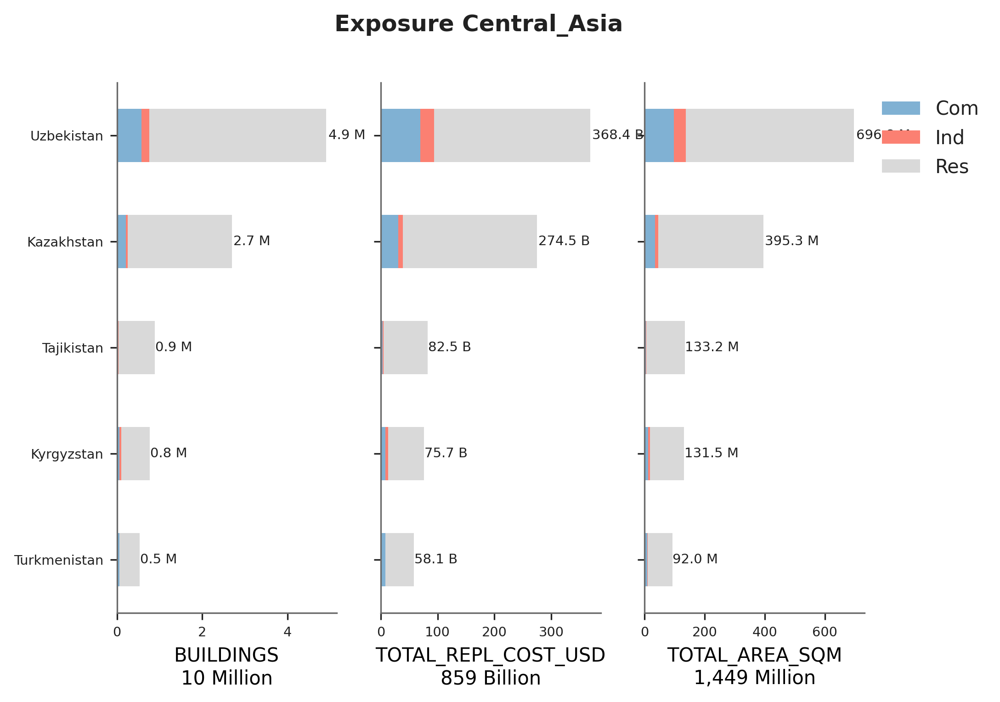
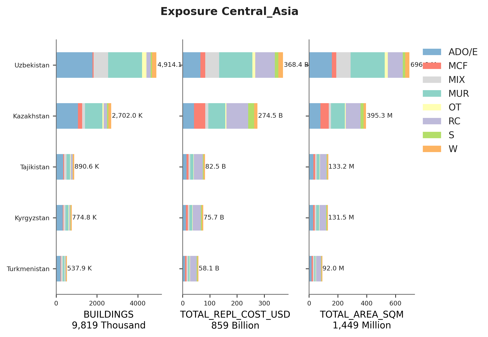

# Central_Asia

## Metadata
|    | ID_0   | NAME_0       | OCCUPANCY   | DATA_SOURCES                                                                                        | PUBLISHER                                                                                    | DATA_YEAR   |   ADM_LEVEL | VARIABLES                                                                                                                          | LINKS                                                                                                                                   |
|---:|:-------|:-------------|:------------|:----------------------------------------------------------------------------------------------------|:---------------------------------------------------------------------------------------------|:------------|------------:|:-----------------------------------------------------------------------------------------------------------------------------------|:----------------------------------------------------------------------------------------------------------------------------------------|
|  0 | KAZ    | Kazakhstan   | RES         | Statistical Compilation on the Housing Stock                                                        | Bureau of National statistics                                                                | 2021        |           2 | Number of houses by exterior wall materials and commissioning year; Total area of residential buildings by exterior wall materials | https://stat.gov.kz/edition/publication/collection                                                                                      |
|  1 | KAZ    | Kazakhstan   | IND, COM    | 2020 statistical compilations ´Services in the Republic of Kazakhstan and ´Employment in Kazakhstan | Bureau of National statistics                                                                | 2020        |           2 | Employment by economic activites and regions; Number of registered legal entities                                                  | https://stat.gov.kz/edition/publication/collection                                                                                      |
|  2 | KYR    | Kyrgyzstan   | RES         | Official statistics                                                                                 | National Statistical Committee of the Kyrgyz Republic                                        | 2020, 2021  |           2 | Dwelling houses by territory; Total living  space per 1 people                                                                     | http://stat.kg/en/statistics/zanyatost/                                                                                                 |
|  3 | KYR    | Kyrgyzstan   | IND, COM    | Official statistics                                                                                 | National Statistical Committee of the Kyrgyz Republic                                        | 2020, 2021  |           2 | Number of employees by type of economic activity and territory                                                                     | http://stat.kg/en/statistics/zanyatost/                                                                                                 |
|  4 | TJK    | Tajikistan   | RES         | Official statistics                                                                                 | Agency on Statistics under President of the Republic of Tajikistan                           | 2020        |           3 | Area of housing facilities by region                                                                                               | https://www.stat.tj/en/database-real-sector                                                                                             |
|  5 | TJK    | Tajikistan   | IND, COM    | Official statistics                                                                                 | Agency on Statistics under President of the Republic of Tajikistan                           | 2019        |           3 | Number of employees by economic activity; Economic entities by region                                                              | https://www.stat.tj/en/database-real-sector                                                                                             |
|  6 | TKM    | Turkmenistan | RES         | Key Indicators for Asia and the Pacific                                                             | Asian Development Bank (ADB)                                                                 | 2020        |           1 | Population                                                                                                                         | https://www.adb.org/publications/key-indicators-asia-and-pacific-2020#accordion-3-1                                                     |
|  7 | TKM    | Turkmenistan | IND, COM    | Key Indicators for Asia and the Pacific                                                             | Asian Development Bank (ADB)                                                                 | 2020        |           1 | Labour force by economic activity                                                                                                  | https://www.adb.org/publications/key-indicators-asia-and-pacific-2020#accordion-3-1                                                     |
|  8 | UZB    | Uzbekistan   | RES         | Official statistics                                                                                 | State Committee of the Republic of Uzbekistan on Statistics                                  | 2020        |           2 | Total area of housing stock by region; Distribution of housing stock by wall material                                              | https://stat.uz/en/official-statistics/environment                                                                                      |
|  9 | UZB    | Uzbekistan   | IND, COM    | Official statistics and Key Indicators for Asia and the Pacific                                     | State Committee of the Republic of Uzbekistan on Statistics and Asian Development Bank (ADB) | 2020        |           2 | Labour force by economic activity                                                                                                  | https://stat.uz/en/official-statistics/labor-market https://www.adb.org/publications/key-indicators-asia-and-pacific-2020#accordion-3-1 |

    