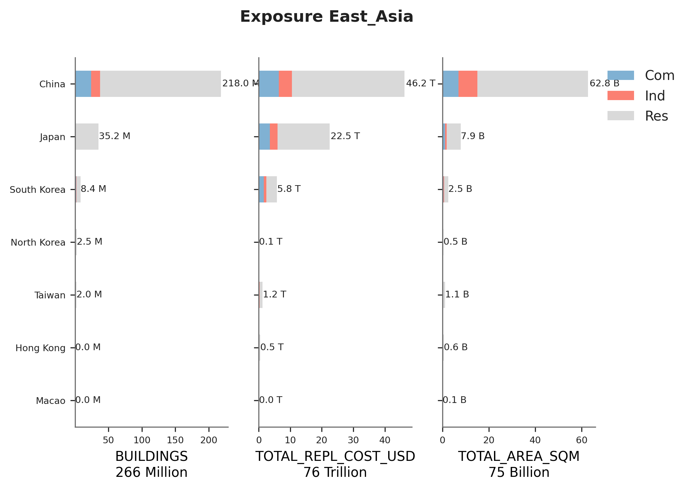
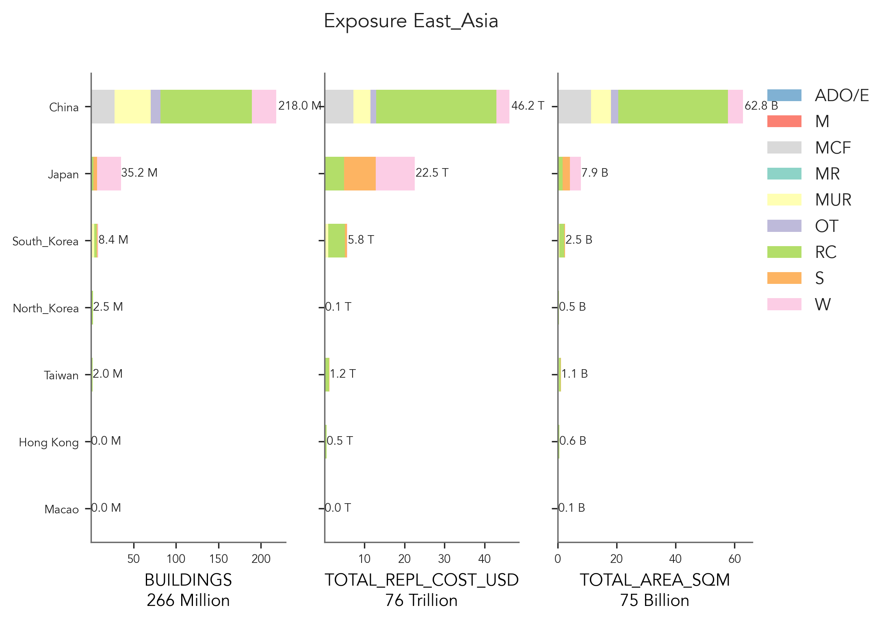

# East_Asia

## Metadata
|    | ID_0   | NAME_0      | OCCUPANCY     | DATA_SOURCES                                                        | PUBLISHER                                                        | DATA_YEAR   | ADM_LEVEL   | VARIABLES                                   | AVAILABLE_UPDATES                                                                                                                                                                                                | NOTES                                                                                                                      | LINKS                                                                                                     |
|---:|:-------|:------------|:--------------|:--------------------------------------------------------------------|:-----------------------------------------------------------------|:------------|:------------|:--------------------------------------------|:-----------------------------------------------------------------------------------------------------------------------------------------------------------------------------------------------------------------|:---------------------------------------------------------------------------------------------------------------------------|:----------------------------------------------------------------------------------------------------------|
|  0 | CHN    | China       | RES           | Sixth National Population Census (2010)                             | National Bureau of Statistics of China                           | 2010        | 4           | Primary construction type                   | Yang, C., & Zhao, S. (2022). A building height dataset across China in 2017 estimated by the spatially-informed approach. Scientific Data, 9(1), 1–11. DOI: https://doi.org/10.1038/s41597-022-01192-x           | nan                                                                                                                        | China: http://www.stats.gov.cn/english/Statisticaldata/CensusData/rkpc2010/indexce.htm                    |
|    |        |             |               | Province Housing Data Tables (2010)                                 |                                                                  |             |             | Number of storeys                           |                                                                                                                                                                                                                  |                                                                                                                            |                                                                                                           |
|    |        |             |               | County Household Data Tables (2010)                                 |                                                                  |             |             | Period of construction                      |                                                                                                                                                                                                                  |                                                                                                                            | Heilongjiang: http://www.hlj.stats.gov.cn/tjnj/2017nj.zip                                                 |
|    |        |             |               | Township Population Data Tables (2010)                              |                                                                  |             |             | Settlement type (urban, town, rural)        |                                                                                                                                                                                                                  |                                                                                                                            | Shanghai: http://www.stats-sh.gov.cn/html/sjfb/201801/1001529.html                                        |
|    |        |             |               | 1% Population Sampling Survey (2015)                                |                                                                  |             |             |                                             |                                                                                                                                                                                                                  |                                                                                                                            | Jiangsu: http://www.jssb.gov.cn/2017nj/nj01.htm                                                           |
|    |        |             |               | National Statistical Yearbook Tables (2017)                         |                                                                  |             |             |                                             |                                                                                                                                                                                                                  |                                                                                                                            | Zhejiang: http://tjj.zj.gov.cn/tjsj/tjnj/DesktopModules/Reports/14.浙江统计年鉴2017/excel/en/index.html   |
|    |        |             |               | Province Statistical Yearbook Tables (2017)                         |                                                                  |             |             |                                             |                                                                                                                                                                                                                  |                                                                                                                            | Anhui: http://www.ahtjj.gov.cn/tjjweb/tjnj/2017/cn.html                                                   |
|    |        |             |               | City Statistical Yearbook Tables (2010–17)                          |                                                                  |             |             |                                             |                                                                                                                                                                                                                  |                                                                                                                            | Fujian: http://tjj.fujian.gov.cn/tongjinianjian/dz2017/index-cn.htm                                       |
|    |        |             |               |                                                                     |                                                                  |             |             |                                             |                                                                                                                                                                                                                  |                                                                                                                            | Jiangxi: http://www.jxstj.gov.cn/resource/nj/2017CD/indexee.htm                                           |
|    |        |             |               |                                                                     |                                                                  |             |             |                                             |                                                                                                                                                                                                                  |                                                                                                                            | Shandong: http://www.stats-sd.gov.cn/tjnj/nj2017/indexee.htm                                              |
|    |        |             |               |                                                                     |                                                                  |             |             |                                             |                                                                                                                                                                                                                  |                                                                                                                            | Henan: http://www.ha.stats.gov.cn/hntj/lib/tjnj/2017/indexee.htm                                          |
|    |        |             |               |                                                                     |                                                                  |             |             |                                             |                                                                                                                                                                                                                  |                                                                                                                            | Hubei: http://data.hb.stats.cn/PlatForm/Attach/201704/7241_201609280221059.rar                            |
|    |        |             |               |                                                                     |                                                                  |             |             |                                             |                                                                                                                                                                                                                  |                                                                                                                            | Hunan: http://data.hntj.gov.cn/sjfb/tjnj/16tjnj/indexee.htm                                               |
|    |        |             |               |                                                                     |                                                                  |             |             |                                             |                                                                                                                                                                                                                  |                                                                                                                            | Guangdong: http://www.gdstats.gov.cn/tjsj/gdtjnj/201711/U020180323391593622005.zip                        |
|    |        |             |               |                                                                     |                                                                  |             |             |                                             |                                                                                                                                                                                                                  |                                                                                                                            | Guangxi: http://www.gxtj.gov.cn/tjsj/tjnj/2017/indexee.htm                                                |
|    |        |             |               |                                                                     |                                                                  |             |             |                                             |                                                                                                                                                                                                                  |                                                                                                                            | Hainan: http://stats.hainan.gov.cn/2017nj/indexee.htm                                                     |
|    |        |             |               |                                                                     |                                                                  |             |             |                                             |                                                                                                                                                                                                                  |                                                                                                                            | Chongqing: http://www.cqtj.gov.cn/tjnj/2017/indexee.htm                                                   |
|    |        |             |               |                                                                     |                                                                  |             |             |                                             |                                                                                                                                                                                                                  |                                                                                                                            | Sichuan: http://www.sc.stats.gov.cn/tjcbw/tjnj/2016/zk/indexee.htm                                        |
|    |        |             |               |                                                                     |                                                                  |             |             |                                             |                                                                                                                                                                                                                  |                                                                                                                            | Guizhou: http://www.gz.stats.gov.cn/tjsj_35719/sjcx_35720/gztjnj_40112/2017/index_26.html                 |
|    |        |             |               |                                                                     |                                                                  |             |             |                                             |                                                                                                                                                                                                                  |                                                                                                                            | Yunnan: http://www.stats.yn.gov.cn/tjsj/tjnj/201701/t20170123_675375.html                                 |
|    |        |             |               |                                                                     |                                                                  |             |             |                                             |                                                                                                                                                                                                                  |                                                                                                                            | Shaanxi: http://www.shaanxitj.gov.cn/upload/2018/7/zk/indexee.htm                                         |
|    |        |             |               |                                                                     |                                                                  |             |             |                                             |                                                                                                                                                                                                                  |                                                                                                                            | Gansu: http://www.gstj.gov.cn/HdAtt/att/2018/03/20180321111139347.rar                                     |
|    |        |             |               |                                                                     |                                                                  |             |             |                                             |                                                                                                                                                                                                                  |                                                                                                                            | Qinghai: http://www.qhtjj.gov.cn/nj/2017/indexce.htm                                                      |
|    |        |             |               |                                                                     |                                                                  |             |             |                                             |                                                                                                                                                                                                                  |                                                                                                                            | Ningxia: http://www.nxtj.gov.cn/tjsj/ndsj/2017/indexfiles/indexch.htm                                     |
|    |        |             |               |                                                                     |                                                                  |             |             |                                             |                                                                                                                                                                                                                  |                                                                                                                            | Xinjiang: http://www.xjtj.gov.cn/sjcx/tjnj_3415/                                                          |
|  1 | CHN    | China       | IND, COM      | Third National Economic Census                                      | National Bureau of Statistics of China                           | 2014        | 1           | Establishments by economic activity         | Dong, L., Yuan, X., Li, M., Ratti, C., & Liu, Y. (2021). A gridded establishment dataset as a proxy for economic activity in China. Scientific Data, 8(1), 1–9. DOI: https://doi.org/10.1038/s41597-020-00792-9 | nan                                                                                                                        | https://data.stats.gov.cn/english/                                                                        |
|    |        |             |               |                                                                     |                                                                  |             |             |                                             |                                                                                                                                                                                                                  |                                                                                                                            |                                                                                                           |
|    |        |             |               |                                                                     |                                                                  |             |             |                                             | Fan, C., Huang, X., Zhou, L., Gai, Z., Zhu, C., & Zhang, H. (2022). China’s Gridded Manufacturing Dataset. Scientific Data, 9(1), 1–14. DOI: https://doi.org/10.1038/s41597-022-01848-8                         |                                                                                                                            |                                                                                                           |
|  2 | HKG    | Hong Kong   | RES, COM, IND | Hong Kong Housing Authority Estates                                 | Various                                                          | 2020        | Bldg        | Building footprint                          | Building inventory of Hong Kong                                                                                                                                                                                  | nan                                                                                                                        | https://bmis2.buildingmgt.gov.hk/bd_hadbiex/content/searchbuilding/building_search.jsf?renderedValue=true |
|    |        |             |               | Hong Kong Housing Society Estates                                   |                                                                  |             |             | Building height                             |                                                                                                                                                                                                                  |                                                                                                                            | https://data.gov.hk/en-data/dataset/hk-rvd-tsinfo_rvd-names-of-buildings                                  |
|    |        |             |               | Building Management: Database of all Private Buildings in Hong Kong |                                                                  |             |             | Building use                                |                                                                                                                                                                                                                  |                                                                                                                            | https://www.housingauthority.gov.hk/en/global-elements/estate-locator/index.html                          |
|    |        |             |               | Database of shopping centers                                        |                                                                  |             |             |                                             |                                                                                                                                                                                                                  |                                                                                                                            |                                                                                                           |
|    |        |             |               | Database of “flatted” factories                                     |                                                                  |             |             |                                             |                                                                                                                                                                                                                  |                                                                                                                            |                                                                                                           |
|  3 | JPN    | Japan       | RES           | Population and Housing Census                                       | Statistics Bureau of Japan                                       | 2015        | 2           | Year of construction                        | 2020 Population and Housing Census                                                                                                                                                                               | nan                                                                                                                        | https://www.stat.go.jp/english/data/kokusei/2015/summary.html                                             |
|    |        |             |               |                                                                     |                                                                  |             |             | Type of housing                             |                                                                                                                                                                                                                  |                                                                                                                            |                                                                                                           |
|    |        |             |               |                                                                     |                                                                  |             |             | Settlement type (urban, rural)              |                                                                                                                                                                                                                  |                                                                                                                            |                                                                                                           |
|    |        |             |               |                                                                     |                                                                  |             |             | Number of storeys                           |                                                                                                                                                                                                                  |                                                                                                                            |                                                                                                           |
|    |        |             |               |                                                                     |                                                                  |             |             | Primary construction material               |                                                                                                                                                                                                                  |                                                                                                                            |                                                                                                           |
|  4 | JPN    | Japan       | IND, COM      | 2008 Corporations Survey of Buildings                               | Statistics Bureau of Japan                                       | 2008–2020   | 2           | Type Of Industry                            | nan                                                                                                                                                                                                              | nan                                                                                                                        | https://www.e-stat.go.jp/en/stat-search/database?page=1&toukei=00600480                                   |
|    |        |             |               | Building Starts 2008–2020                                           |                                                                  |             |             | Main Usage Of Building                      |                                                                                                                                                                                                                  |                                                                                                                            | https://www.e-stat.go.jp/en/stat-search/files?tstat=000001016965                                          |
|    |        |             |               |                                                                     |                                                                  |             |             | Number Of Buildings                         |                                                                                                                                                                                                                  |                                                                                                                            |                                                                                                           |
|    |        |             |               |                                                                     |                                                                  |             |             | Floor Space                                 |                                                                                                                                                                                                                  |                                                                                                                            |                                                                                                           |
|    |        |             |               |                                                                     |                                                                  |             |             | Number Of Floors                            |                                                                                                                                                                                                                  |                                                                                                                            |                                                                                                           |
|    |        |             |               |                                                                     |                                                                  |             |             | Structural Type                             |                                                                                                                                                                                                                  |                                                                                                                            |                                                                                                           |
|    |        |             |               |                                                                     |                                                                  |             |             | Year Construction                           |                                                                                                                                                                                                                  |                                                                                                                            |                                                                                                           |
|  5 | KOR    | South Korea | RES           | Population and Housing Census 2020                                  | Statistics Korea                                                 | 2020        | 1           | Population, houses, and housing units       | Available annually                                                                                                                                                                                               | Wall material data was additionally investigated from the Ministry of Land, Infrastructure and Transport (MOLIT) from 2015 | https://kosis.kr/eng/                                                                                     |
|    |        |             |               |                                                                     |                                                                  |             |             | Housing unit type, area, and household size |                                                                                                                                                                                                                  |                                                                                                                            |                                                                                                           |
|  6 | KOR    | South Korea | IND, COM      | Census of Establishments 2020                                       | Statistics Korea                                                 | 2020        | 1           | Number of establishments                    | Available annually                                                                                                                                                                                               | nan                                                                                                                        | https://kosis.kr/eng/                                                                                     |
|    |        |             |               |                                                                     |                                                                  |             |             | Number of workers                           |                                                                                                                                                                                                                  |                                                                                                                            |                                                                                                           |
|  7 | MAC    | Macao       | RES           | 15th Population Census and 5th Housing Census of 2011               | Statistics and Census Service (DSEC)                             | 2011, 2016  | 2           | Year of completion                          | Building inventory of Macao                                                                                                                                                                                      | nan                                                                                                                        | https://www.dsec.gov.mo/en-US/Statistic?id=104                                                            |
|    |        |             |               | Population by-Census of 2016                                        |                                                                  |             |             | Number of storeys                           |                                                                                                                                                                                                                  |                                                                                                                            |                                                                                                           |
|    |        |             |               |                                                                     |                                                                  |             |             | Type of housing                             |                                                                                                                                                                                                                  |                                                                                                                            |                                                                                                           |
|  8 | MAC    | Macao       | IND, COM      | Macao Industry Overview                                             | Statistics and Census Service (DSEC)                             | 2020        | 2           | Number of establishments by sector          | Building inventory of Macao                                                                                                                                                                                      | nan                                                                                                                        | https://www.dsec.gov.mo/en-US/Statistic?id=8                                                              |
|  9 | PRK    | North Korea | RES           | Socio-economic, Demographic, and Health Survey 2014                 | Central Bureau of Statistics (CBS)                               | 2014        | 1           | Population                                  | nan                                                                                                                                                                                                              | Most recent Population Census was in year 2008                                                                             | https://dprkorea.un.org/en/10162-2014-socio-economic-demographic-and-health-survey                        |
|    |        |             |               | Population Census 2008                                              |                                                                  |             |             | Households                                  |                                                                                                                                                                                                                  |                                                                                                                            |                                                                                                           |
|    |        |             |               |                                                                     |                                                                  |             |             | Housing type                                |                                                                                                                                                                                                                  |                                                                                                                            |                                                                                                           |
| 10 | PRK    | North Korea | IND, COM      | International Labour Organization (ILO)                             | International Labour Organization (ILO)                          | 2019        | 0           | nan                                         | nan                                                                                                                                                                                                              | Data essentially non-existant, International Labour Organization (ILO) estimates were used                                 | https://www.ilo.org/global/lang--en/index.htm                                                             |
| 11 | TWN    | Taiwan      | RES           | Population and Housing Census                                       | Directorate General of Budget, Accounting and Statistics (DGBAS) | 2010        | 2           | Built period                                | 2020 Population and Housing Census                                                                                                                                                                               | nan                                                                                                                        | https://census.dgbas.gov.tw/PHC2010/english/rehome.htm                                                    |
|    |        |             |               |                                                                     |                                                                  |             |             | Structural material                         |                                                                                                                                                                                                                  |                                                                                                                            |                                                                                                           |
|    |        |             |               |                                                                     |                                                                  |             |             | Number of floors                            |                                                                                                                                                                                                                  |                                                                                                                            |                                                                                                           |
| 12 | TWN    | Taiwan      | IND, COM      | Industry and Service Census                                         | Directorate General of Budget, Accounting and Statistics (DGBAS) | 2011        | 2           | Number of establishments                    | 2016 Industry and Service Census                                                                                                                                                                                 | nan                                                                                                                        | https://eng.stat.gov.tw/News_Content.aspx?n=2395&s=214631                                                 |

    