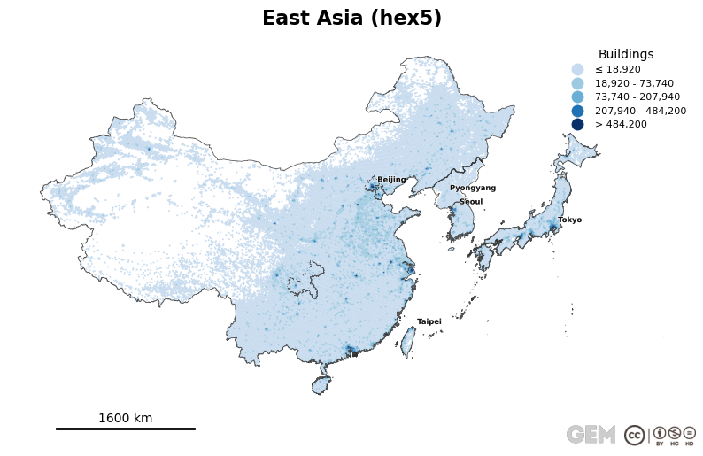
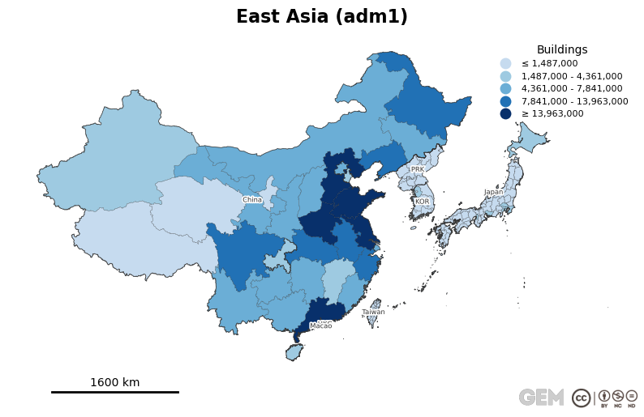
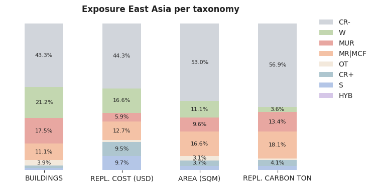
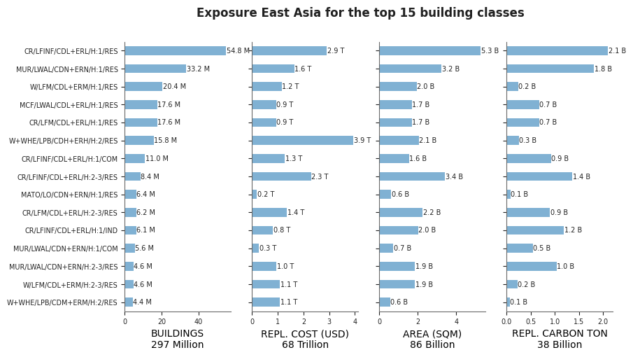

# East Asia Exposure Model

## ✨ Overview

> The `v2026.0.0` release for the East Asia exposure model is now available! 🥳 🚀

This repository contains the latest exposure model files for the countries and territories in **East Asia**.

Files are organized by country and territory, each containing the following:

- **Summaries:** CSV tables and figures summarizing building exposure at the national (Adm0), subnational (Adm1), and taxonomy levels.
- **Exposure model:** Spatially disaggregated building exposure at 0.01 degrees (approximately 1km) resolution in `csv.gz` format, available for residential (RES), commercial (COM), and industrial (IND) occupancy classes.
- `Vulnerability_mapping_ISO3.csv`: Vulnerability mapping  file per country or territory.

For more information, visit the [GEM Global Risk Model documentation](https://docs.openquake.org/global_risk_model/) site.
Spatially disaggregated models are also available and can be accessed by submitting a request through the [GEM License Request page](https://www.globalquakemodel.org/license-request/global-exposure-model).

## 🔎 Quick links

[[_TOC_]]

## 🚀 Model versions

Each version of the model that is released can be accessed by changing from the `main` branch to the `tag` of a given version.
The `main` branch could contain the work-in-progress of the next version of the model.
[Check out here how to change the version](#which-version-am-i-seeing-how-to-change-the-version)

To view the full list of model versions, see the [CHANGELOG.md](./CHANGELOG.md).

## 🌍 Country list

The following countries are covered in this repository. Each country name links to its dedicated README page.

  
👀 click to see country list

| COUNTRY | ISO3 |
|---------|------|
| [China](China/README.md) | CHN |
| [Hong_Kong](Hong_Kong/README.md) | HKG |
| [Japan](Japan/README.md) | JPN |
| [Macao](Macao/README.md) | MAC |
| [North_Korea](North_Korea/README.md) | PRK |
| [South_Korea](South_Korea/README.md) | KOR |
| [Taiwan](Taiwan/README.md) | TWN |

## 📊 Regional summary

The regional exposure includes the distribution of buildings, replacement value, and exposed population across all countries in **East Asia**. The regional exposure includes 297.1 million buildings, USD 68.1 trillion in replacement cost, and 1.6 billion occupants. The figure below shows the spatial distribution of building counts aggregated onto a discrete hexagonal grid at H3 resolution 5. See [Adm0 summary table](_region/Exposure_East_Asia_Adm0.csv) for additional national level metrics.

<!-- Map with national buildings -->

_Figure: Spatial distribution of building counts aggregated onto a discrete hexagonal grid_

_Figure: Spatial distribution of building counts aggregated at the first administrative division_

<!-- Table with Adm0 regional summary -->
_Table: Regional exposure model summary per country in East Asia. See [Adm0 summary table](_region/Exposure_East_Asia_Adm0.csv) for the comple list of national level metrics._

| COUNTRY | BUILDINGS | OCCUPANTS | REPLACEMENT COST (USD) | BUILT-UP AREA (SQM) | EMBODIED CARBON (TON) |
|---|---|---|---|---|---|
| China | 244.0 M | 1.4 B | 41.5 T | 73.1 B | 32.8 B |
| Japan | 37.5 M | 0.1 B | 18.9 T | 7.9 B | 2.3 B |
| South Korea | 8.7 M | 0.1 B | 3.8 T | 2.7 B | 1.2 B |
| Taiwan | 4.0 M | 0.0 B | 2.1 T | 1.3 B | 0.6 B |
| North Korea | 2.8 M | 0.0 B | 0.1 T | 0.5 B | 0.2 B |
| Hong Kong | 0.0 M | 0.0 B | 1.5 T | 0.6 B | 0.3 B |
| Macao | 0.0 M | 0.0 B | 0.1 T | 0.1 B | 0.0 B |

<!-- Figures -->

_Figure: Regional distribution of exposure by macro-taxonomy._

_Figure: Predominant building classes in the region._

## 🌟 Contributors

The authors are grateful for the input from dozens of local and international experts. A list of contributors can be found at https://www.globalquakemodel.org/risk-model-contributors.

## 📚 Publications

If you make use of this work, please cite both the publication and the data.

**Publications:**

Yepes-Estrada, C., Calderon, A., Costa, C., Crowley, H., Dabbeek, J., Hoyos, M., Martins, L., Paul, N., Rao, A., Silva, V. (2023). Global Building Exposure Model for Earthquake Risk Assessment. Earthquake Spectra. [doi:10.1177/87552930231194048]( https://doi.org/10.1177/87552930231194048)

<!-- ### Publications -->

Ma, Jian, Anirudh Rao, Vitor Silva, Kai Liu, and Ming Wang. "A township-level exposure model of residential buildings for mainland China." *Natural Hazards 108, no. 1* (2021): 389-423. https://link.springer.com/article/10.1007/s11069-021-04689-7

**Data:**

Yepes-Estrada, C., Baiguera, M., Calderon, A., Caruso, M., Costa, C., Gonzalez, D., Nafeh, A.M.B., Rao, A., Silva, V. (2026). Global Exposure Model (2026.0.0). [doi.org/10.5281/zenodo.8117363](https://doi.org/10.5281/zenodo.8117363) 

## ⚖️ License

[![CC BY-NC-SA 4.0][cc-by-nc-sa-shield]][cc-by-nc-sa]

This work is licensed under a
[Creative Commons Attribution-NonCommercial-ShareAlike 4.0 International License][cc-by-nc-sa], which requires:

* Attribution (you must give appropriate credit, provide a link to the license, and indicate if changes were made)
* Non-commercial (you may not use the material for commercial purposes)
* ShareAlike (derivatives created must be made available under the same license as the original)

If your use case deviates from the requirements of the offered license, but still want to explore the use of the data, please contact us at license@globalquakemodel.org  

[![CC BY-NC-SA 4.0][cc-by-nc-sa-image]][cc-by-nc-sa]

[cc-by-nc-sa]: http://creativecommons.org/licenses/by-nc-sa/4.0/
[cc-by-nc-sa-image]: https://licensebuttons.net/l/by-nc-sa/4.0/88x31.png
[cc-by-nc-sa-shield]: https://img.shields.io/badge/License-CC%20BY--NC--SA%204.0-lightgrey.svg

Any deviation from these terms incurs license infringement. For commercial use of the data contained within this work, a specific license agreement must be made tailored to your use case, in such instance please contact GEM at product@globalquakemodel.org.

## 🤔 Frequently Asked Questions (FAQs)

### Which version am I seeing? How to change the version?

By default you will see the files in the repository in the `main` branch. Each version of the model that is released is marked with a `tag`. By changing the tag version at the top of the repository, you can see the files for a given version.

Note that the `main` branch could contain the work-in-progress of the next version of the model.

### How do I download the data for a given version?

For each version, a released zip file is available: [release zip file downloads](https://github.com/gem/global_exposure_model/releases/).

### Where can I find additional information on the defined building classes?

The building classes defined within this exposure model follow the [GEM Building Taxonomy v4.0](https://tools.openquake.org/taxonomy/). The link provides additional details on taxonomy substrings, images and detailed description of each attribute.

Building classes are mapped to corresponding vulnerability functions available in the [GEM's Global Vulnerability Model](https://github.com/gem/global_vulnerability_model). Inside each country there is available a `Vulnerability_mapping_ISO3.csv` file useful for earthquake risk assessment using the OpenQuake engine.

### What do the column headers mean?

Definitions and descriptions of the columns in the exposure summary tables.

  
👀 click to see definitions and descriptions

| HEADER | DESCRIPTION |
|---|---|
| ASSET_ID | Unique identifier for an asset, which comprises a group of buildings sharing similar attributes and location |
| ID_0 | ISO3 code for the country |
| NAME_0 | English name for the country |
| ID_1 | ID for the first administrative level, matches either the ID used in the national census or in the administrative division boundary vector files, or both |
| NAME_1 | Name of the first administrative level |
| ID_i | ID for the "ith" administrative level |
| NAME_i | Name of the "ith" administrative level |
| LONGITUDE | Geographical longitude cordinate of the asset location. In general, these locations do not represent building-specific geolocations, they represent points as a result of a spatial disaggregation algorithm (and thus still represent aggregated assets) but at a finer resolution. |
| LATITUDE | Geographical latitude cordinate of the asset location. In general, these locations do not represent building-specific geolocations, they represent points as a result of a spatial disaggregation algorithm (and thus still represent aggregated assets) but at a finer resolution. |
| OCCUPANCY | Primary occupancy class (RES: residential; COM: commercial; IND: industrial) |
| OCCUPANCY_TYPE | Detailed occupancy providing a finer classification within the primary OCCUPANCY class, describing the specific functional use of the structure as defined in the GEM taxonomy (e.g., [RES:1] single dwelling; [COM:3C] hotels and motels; [IND:2] light-industry factories). |
| SETTLEMENT | Type of settlement (e.g., URBAN, RURAL, SUBURBAN, URBAN_CENTER) |
| TAXONOMY | Building taxonomy string that is used for mapping vulnerability functions for the asset |
| TAXONOMY_HAZUS | Building taxonomy string compatible with HAZUS classification |
| MACRO_TAXONOMY | High-level classification of building types used in the Global Exposure Model for statistical analysis |
| BUILDINGS | The total number of buildings comprising the asset. A building unit is defined as a permanent, separate, and independent structure designed to serve any activity. For constructions comprising blocks, terraced buildings, or buildings enclosed by common fencing, a building unit refers to the superstructure that is structurally designed to respond independently under seismic loads |
| DWELLINGS | The total number of dwellings comprising the asset.  A dwelling unit is defined as a self-contained residential space within a building designed for habitation by one or more individuals or families. For example, a multi-story residential building is comprised of numerous dwelling units, such as multiple apartments within the same structure. Conversely, in a single-family detached unit, the number of dwelling units and buildings is the same |
| ESTABLISHMENTS | The total number of establishments comprising the asset. An establishment is defined as a single physical location where economic activities occur (e.g., services or industrial operations). An establishment is often characterized by having a specific address, management, and operational control, distinct from other units of the same company or organization. |
| OCCUPANTS_TOTAL | The number of residents in each residential asset |
| OCCUPANTS_DAY | The average number of occupants in each asset during the day-time period |
| OCCUPANTS_TRANSIT | The average number of occupants in each asset during the transit time period |
| OCCUPANTS_NIGHT | The average number of occupants in each asset during the night-time period |
| OCCUPANTS_AVERAGE | The time-averaged number of occupants in each asset (residential, commercial, industrial) |
| AVG_DWL_AREA_SQM | Floor area of a dwelling unit (sqm) |
| TOTAL_AREA_SQM | The total floor area comprising the asset (sqm) |
| COST_PER_AREA_USD | The average building cost (as built) per unit area (in US dollars). It includes the structural and nonstructural components, but not the building contents. |
| COST_PER_AREA_LOCAL | Idem as COST_PER_AREA_USD but using the local currency |
| BLDG_REPL_COST_USD | Cost to construct or replace the building components (structural and nonstructural) of  the asset. It does not  includues the contents. |
| COST_STRUCTURAL_USD | Cost to construct or replace (as built) in US dollars of structural components in each asset |
| COST_NONSTRUCTURAL_USD | Cost to construct or replace  (as built) in US dollars of nonstructural components in each asset |
| COST_CONTENTS_USD | Cost to construct or replace  (as built) in US dollars of contents in each asset |
| TOTAL_REPL_COST_USD | Cost to construct or replace the asset with equal quality and construction in US dollars (including the structural, nonstructural components, and building contents) |
| YEAR | Year of construction or retrofit |
| CARBON_BUILDINGS_TON | The building replacement embodied carbon in Ton CO2e for the asset, including structural and nonstructural components (no building contents) |

