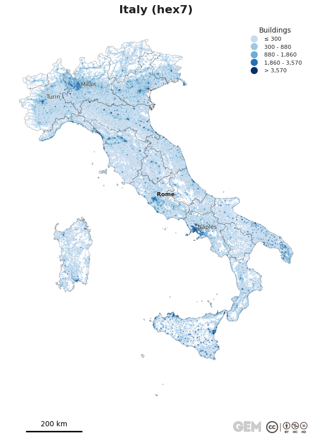
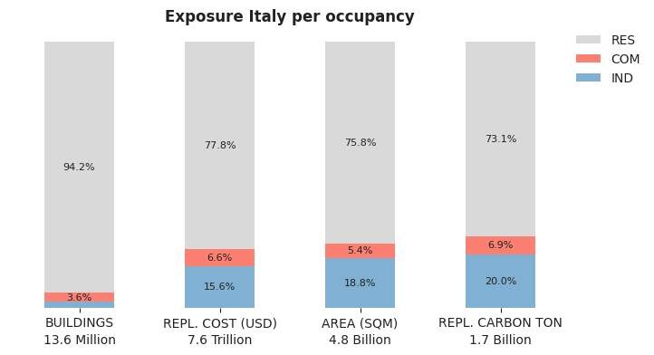
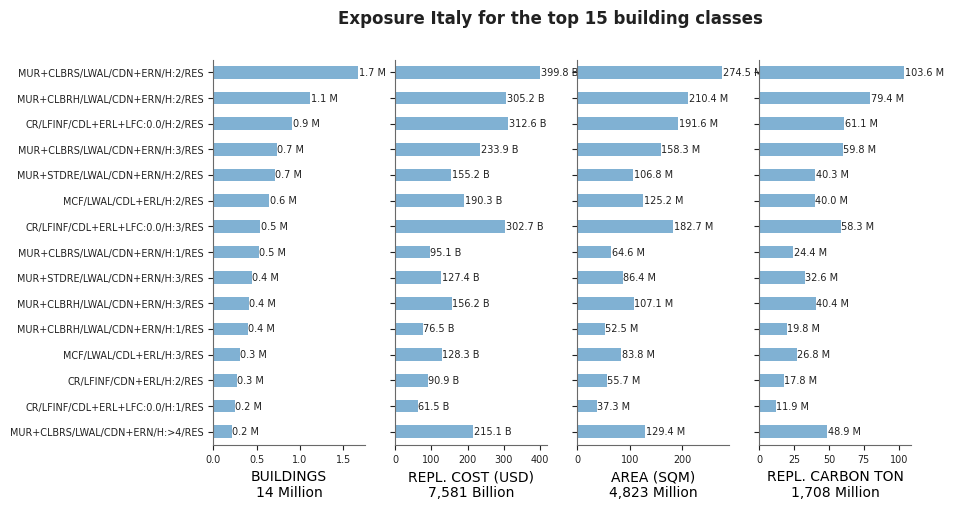
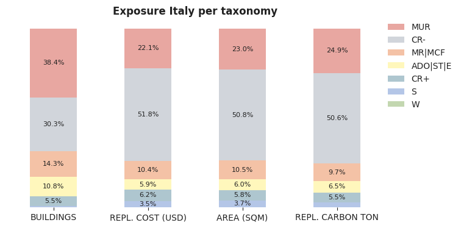
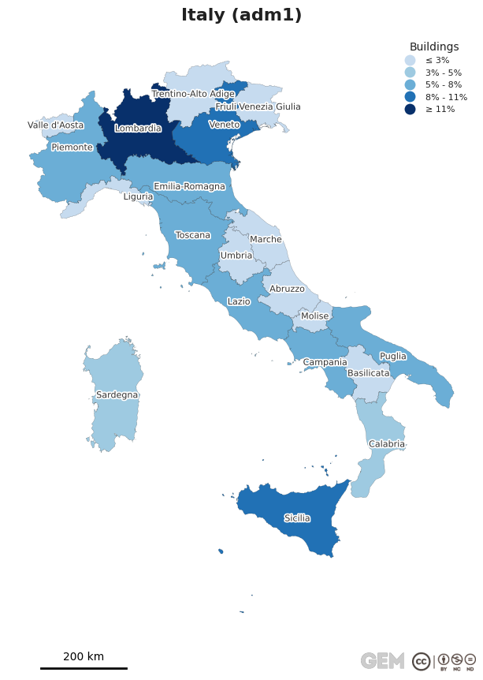
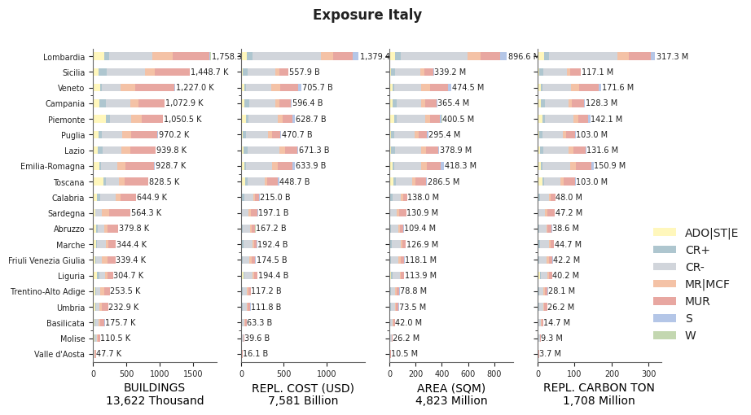

# 🇮🇹 Italy Exposure Model

This page provides an overview of the exposure model for Italy, including national totals, predominant building classes, and subnational distribution.

The exposure model provides an open and harmonised representation of the national building inventory across residential (RES), commercial (COM), and industrial (IND) occupancies, developed within the Global Earthquake Model (GEM) framework.

## ✨ What's New in `v2026.0.0`

- **Unified Framework**: Consistent modelling approach across datasets
- **Standardised Divisions**: First-level administrative divisions carefully reviewed and harmonized
- **Building Classification**: Based on [GEM Building Taxonomy v4.0](https://tools.openquake.org/taxonomy/)
- **Temporal Distribution**: Occupant distribution modelled for different times of day
- **Reference Year**: Building counts, replacement cost and population aligned to 2025
- **Spatial Resolution**: 0.01 degrees (approximately 1×1 km²) grid disaggregation with building-level representations where available
- **Replacement Costs**: Derived from multiple AI-driven models combined with expert judgement
- **Embodied Carbon**: Estimates integrated to support climate impact considerations
- **Versatile Application**: Framework adaptable to various natural hazards beyond seismic risk

For more information, visit the [GEM Global Risk Model documentation](https://docs.openquake.org/global_risk_model/) site.
Spatially disaggregated models are also available and can be accessed by submitting a request through the [GEM License Request page](https://www.globalquakemodel.org/license-request/global-exposure-model).

## 🔎 Quick links

[[_TOC_]]

## National summary

The exposure model includes the distribution of buildings, replacement value, exposed population and embodied carbon. The total exposure includes 13.6 million buildings, USD 7.6 trillion in replacement cost, and 59.1 million occupants. The figure below shows the spatial distribution of building counts aggregated onto a discrete hexagonal grid at H3 resolution 7. See [Adm0 summary table](summaries/Exposure_Summary_Adm0.csv) for additional national level metrics.

<!-- Map with national buildings -->

_Figure: Spatial distribution of building counts aggregated onto a discrete hexagonal grid_

<!-- Table with Adm0 summary -->
_Table: National exposure model per occupancy class._

| COUNTRY | OCCUPANCY | BUILDINGS | OCCUPANTS | REPLACEMENT COST (USD) | BUILT-UP AREA (SQM) | EMBODIED CARBON (TON) |
|---|---|---|---|---|---|---|
| Italy | COM | 0.5 M |  | 0.5 T | 0.3 B | 0.1 B |
| Italy | IND | 0.3 M |  | 1.2 T | 0.9 B | 0.3 B |
| Italy | RES | 12.8 M | 59.1 M | 5.9 T | 3.7 B | 1.2 B |

<!-- Figures -->

_Figure: Contribution of occupancy classes to total national exposure_

## Building Classes

The exposure model classifies the building stock into a set of representative building classes that capture the predominant construction typologies within the country or region. These classes are defined using the [GEM Building Taxonomy v4.0](https://tools.openquake.org/taxonomy/), which provides a standardized framework for grouping buildings with similar structural characteristics. At a minimum, each class is described by attributes such as the primary construction material, lateral load-resisting system, code level, seismic design level, number of stories, and occupancy type; additional attributes may be included where more detailed information is available. Detailed descriptions and illustrations of taxonomy attributes are available in the [Glossary](https://tools.openquake.org/taxonomy/) tab.

For the complete list of building classes in the country or territory, see [Taxonomy summary table](summaries/Exposure_Summary_Taxonomy.csv). Each building class is linked to a corresponding vulnerability class through a vulnerability mapping, available as `Vulnerability_mapping_ITA.csv`, following the definitions of the [GEM Global Vulnerability Model](https://github.com/gem/global_vulnerability_model).

_Figure: Predominant building classes ranked by their contribution to the national exposure model_

The figure below shows the distribution of the exposure model aggregated by `MACRO_TAXONOMY`, a simplified classification that groups building classes according to their predominant construction material and structural system. The categories are defined as follows: `ADO|ST|E` (adobe, stone masonry, and earthen construction), `CR+` (reinforced concrete designed and constructed in accordance with building code requirements), `CR-` (reinforced concrete with limited or no code compliance), `HYB` (hybrid construction combining multiple material classes), `MR|MCF` (reinforced or confined masonry), `MUR` (unreinforced masonry), `S` (steel construction), `W` (wood, bamboo, wattle-and-daub construction), and `OT` (other building classes not included in the preceding categories). This aggregation provides a concise overview of the composition of the building stock while preserving the key structural characteristics relevant for seismic risk assessment.

_Figure: National distribution of exposure by macro-taxonomy_

## Subnational summary

The subnational summary aggregates exposure by first administrative level and supports comparison of spatial concentration of assets. For additional information on the exposure, at the first administrative level, see [Adm1 summary table](summaries/Exposure_Summary_Adm1.csv).

The names of the subnational exposure units (first administrative divisions) have been carefully reviewed, harmonized, and are actively maintained by GEM. The source of the administrative boundaries used is available in the [metadata](#metadata) section.

<!-- Map with national buildings -->

_Figure: Number of buildings at the first-level administrative units_

_Figure: Distribution of predominant building classes across first-level administrative units_

## Source Data

The table below provides source data information for the exposure model components.
For information on modelling assumptions, construction practice and building code, visit the [GEM Global Risk Model documentation](https://docs.openquake.org/global_risk_model/) site.

<!-- Table metadata -->
_Table: Exposure model metadata including data sources, versions, and references._

| COMPONENT | DATA_SOURCES | PUBLISHER | DATA_YEAR | UPDATE_YEAR | ADM_LEVEL | VARIABLES | LICENSE | LINKS | NOTES |
|---|---|---|---|---|---|---|---|---|---|
| RES | Dwellings: 2021 National Census, Buildings, areas: 2011 DPC private data |  | 2021 | 2025.0 | 3 |  |  |  |  |
| OCCUPANTS | Occupants: 2021 National Census |  | 2021 | 2025.0 | 3 |  |  |  |  |
| COM | Buildings: 2011 National Census, Annuari Statistici Italiani 2012-2023 |  | 2023 | 2025.0 | 3 |  |  |  |  |
| IND | Buildings: 2024 GHS-OBAT dataset, Land use: 2021 ISTAT layer M03 |  | 2021, 2024 | 2025.0 | Bldg |  |  | 2024 GHS-OBAT: https://data.jrc.ec.europa.eu/dataset/f41a22f1-5741-4c41-86eb-6384654f6927. ISTAT layer M03: https://www.istat.it/notizia/caratteristiche-territoriali-sezioni-censimento-2021-raggruppate-in-macroaree/. |  |
| COSTS | S.I.S.T.A.N - SISTEMA STATISTICO NAZIONALE |  | 2024 | 2025.0 |  |  |  | Construction Cost Index: https://www.milomb.camcom.it/documents/d/guest/fabbricato-residenziale. | Replacement costs: updated to 2024, based on the Construction Cost Index. |
| BOUNDARIES | World Bank | World Bank | 2025 |  | 1 | Administrative divisions at level 1 | CC BY 4.0 | https://datacatalog.worldbank.org/search/dataset/0038272/world-bank-official-boundaries |  |

## Exposure Model Columns

Definitions and descriptions of the columns in the exposure summary tables.

  
👀 click to see definitions and descriptions

| HEADER | DESCRIPTION |
|---|---|
| ASSET_ID | Unique identifier for an asset, which comprises a group of buildings sharing similar attributes and location |
| ID_0 | ISO3 code for the country |
| NAME_0 | English name for the country |
| ID_1 | ID for the first administrative level, matches either the ID used in the national census or in the administrative division boundary vector files, or both |
| NAME_1 | Name of the first administrative level |
| ID_i | ID for the "ith" administrative level |
| NAME_i | Name of the "ith" administrative level |
| LONGITUDE | Geographical longitude cordinate of the asset location. In general, these locations do not represent building-specific geolocations, they represent points as a result of a spatial disaggregation algorithm (and thus still represent aggregated assets) but at a finer resolution. |
| LATITUDE | Geographical latitude cordinate of the asset location. In general, these locations do not represent building-specific geolocations, they represent points as a result of a spatial disaggregation algorithm (and thus still represent aggregated assets) but at a finer resolution. |
| OCCUPANCY | Primary occupancy class (RES: residential; COM: commercial; IND: industrial) |
| OCCUPANCY_TYPE | Detailed occupancy providing a finer classification within the primary OCCUPANCY class, describing the specific functional use of the structure as defined in the GEM taxonomy (e.g., [RES:1] single dwelling; [COM:3C] hotels and motels; [IND:2] light-industry factories). |
| SETTLEMENT | Type of settlement (e.g., URBAN, RURAL, SUBURBAN, URBAN_CENTER) |
| TAXONOMY | Building taxonomy string that is used for mapping vulnerability functions for the asset |
| TAXONOMY_HAZUS | Building taxonomy string compatible with HAZUS classification |
| MACRO_TAXONOMY | High-level classification of building types used in the Global Exposure Model for statistical analysis |
| BUILDINGS | The total number of buildings comprising the asset. A building unit is defined as a permanent, separate, and independent structure designed to serve any activity. For constructions comprising blocks, terraced buildings, or buildings enclosed by common fencing, a building unit refers to the superstructure that is structurally designed to respond independently under seismic loads |
| DWELLINGS | The total number of dwellings comprising the asset.  A dwelling unit is defined as a self-contained residential space within a building designed for habitation by one or more individuals or families. For example, a multi-story residential building is comprised of numerous dwelling units, such as multiple apartments within the same structure. Conversely, in a single-family detached unit, the number of dwelling units and buildings is the same |
| ESTABLISHMENTS | The total number of establishments comprising the asset. An establishment is defined as a single physical location where economic activities occur (e.g., services or industrial operations). An establishment is often characterized by having a specific address, management, and operational control, distinct from other units of the same company or organization. |
| OCCUPANTS_TOTAL | The number of residents in each residential asset |
| OCCUPANTS_DAY | The average number of occupants in each asset during the day-time period |
| OCCUPANTS_TRANSIT | The average number of occupants in each asset during the transit time period |
| OCCUPANTS_NIGHT | The average number of occupants in each asset during the night-time period |
| OCCUPANTS_AVERAGE | The time-averaged number of occupants in each asset (residential, commercial, industrial) |
| AVG_DWL_AREA_SQM | Floor area of a dwelling unit (sqm) |
| TOTAL_AREA_SQM | The total floor area comprising the asset (sqm) |
| COST_PER_AREA_USD | The average building cost (as built) per unit area (in US dollars). It includes the structural and nonstructural components, but not the building contents. |
| COST_PER_AREA_LOCAL | Idem as COST_PER_AREA_USD but using the local currency |
| BLDG_REPL_COST_USD | Cost to construct or replace the building components (structural and nonstructural) of  the asset. It does not  includues the contents. |
| COST_STRUCTURAL_USD | Cost to construct or replace (as built) in US dollars of structural components in each asset |
| COST_NONSTRUCTURAL_USD | Cost to construct or replace  (as built) in US dollars of nonstructural components in each asset |
| COST_CONTENTS_USD | Cost to construct or replace  (as built) in US dollars of contents in each asset |
| TOTAL_REPL_COST_USD | Cost to construct or replace the asset with equal quality and construction in US dollars (including the structural, nonstructural components, and building contents) |
| YEAR | Year of construction or retrofit |
| CARBON_BUILDINGS_TON | The building replacement embodied carbon in Ton CO2e for the asset, including structural and nonstructural components (no building contents) |

## Other Resources

- [Regional overview](../README.md)
- [Model versions](../CHANGELOG.md)
- [Frequently asked questions](../README.md#frequently-asked-questions)
- [Contributors](../README.md#contributors)
- [How to cite this work](../README.md#publications)
- [License](../README.md#license)