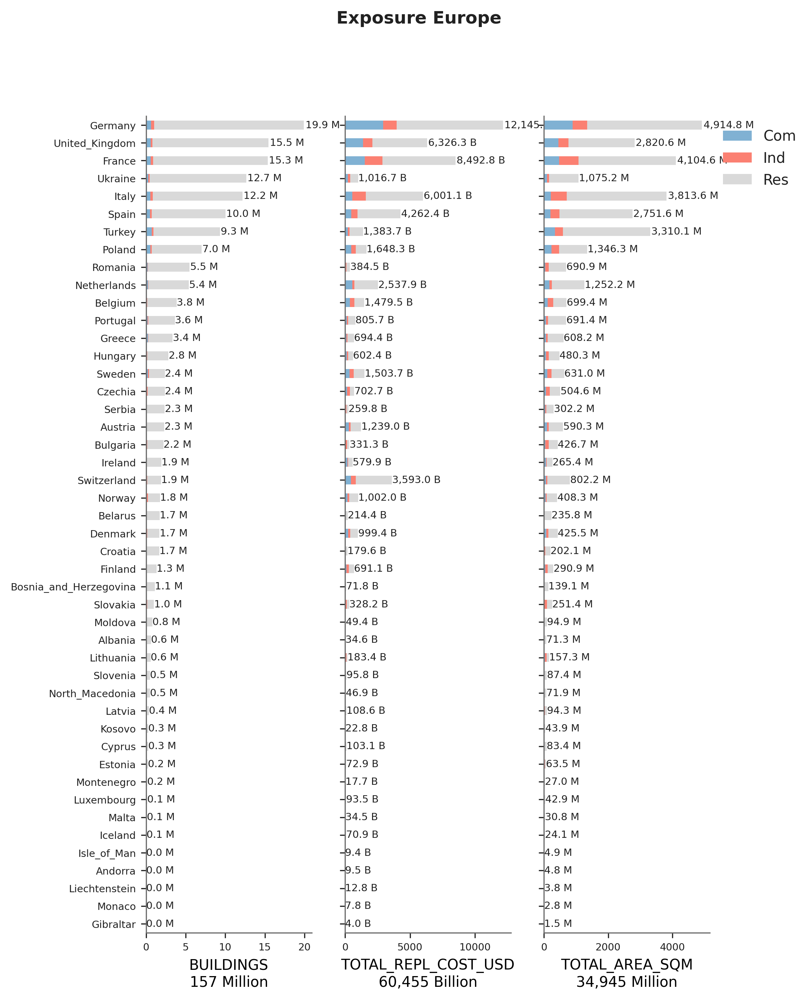
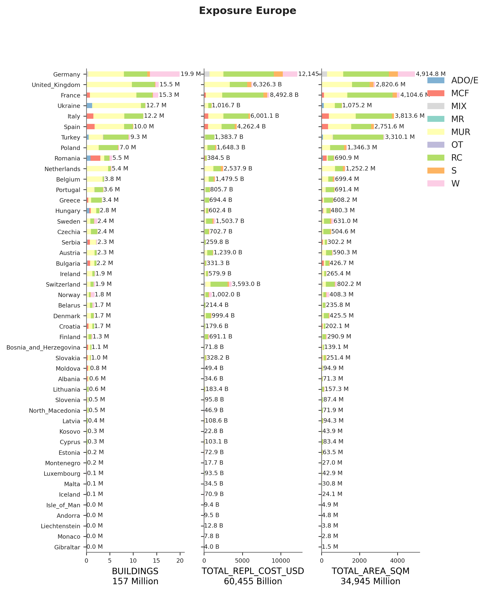

# Europe

## Mapping schemes

Please refer to the public repository: [https://gitlab.seismo.ethz.ch/efehr/esrm20_exposure](https://gitlab.seismo.ethz.ch/efehr/esrm20_exposure)

## Metadata
Please refer to the public repository: [https://gitlab.seismo.ethz.ch/efehr/esrm20_exposure](https://gitlab.seismo.ethz.ch/efehr/esrm20_exposure)
|    | D_0   | NAME_0   | OCCUPANCY     | DATA_SOURCES                                         | PUBLISHER                                   | DATA_YEAR   |   ADM_LEVEL | VARIABLES                                              | AVAILABLE_UPDATES   | LINKS                                                                                                                |
|---:|:------|:---------|:--------------|:-----------------------------------------------------|:--------------------------------------------|:------------|------------:|:-------------------------------------------------------|:--------------------|:---------------------------------------------------------------------------------------------------------------------|
|  0 | TUR   | Türkiye  | RES, COM, IND | Bina Sayımı (Building Census) of Turkey              | Başbakanlık Devlet İstatistik Enstitüsü     | 2000        |           1 | Occupancy class                                        | nan                 | nan                                                                                                                  |
|    |       |          |               |                                                      |                                             |             |             | Primary use class                                      |                     |                                                                                                                      |
|    |       |          |               |                                                      |                                             |             |             | Number of stories                                      |                     |                                                                                                                      |
|    |       |          |               |                                                      |                                             |             |             | Floor areas                                            |                     |                                                                                                                      |
|    |       |          |               |                                                      |                                             |             |             | Structural system and primary material of construction |                     |                                                                                                                      |
|    |       |          |               |                                                      |                                             |             |             | Decade of construction                                 |                     |                                                                                                                      |
|  1 | TUR   | Türkiye  | RES, COM, IND | Building Permit Statistics                           | Türkiye İstatistik Kurumu (TÜİK / TurkStat) | 2001–2020   |           1 | Occupancy class                                        | Annual              | https://biruni.tuik.gov.tr/yapiizin/giris.zul?dil=ing                                                                |
|    |       |          |               |                                                      |                                             |             |             | Primary use class                                      |                     |                                                                                                                      |
|    |       |          |               |                                                      |                                             |             |             | Year of construction                                   |                     |                                                                                                                      |
|  2 | TUR   | Türkiye  | RES, COM, IND | Address Based Population Registration System (ABPRS) | Türkiye İstatistik Kurumu (TÜİK / TurkStat) | 2020        |           4 | Population                                             | Annual              | https://data.tuik.gov.tr/Bulten/Index?p=The-Results-of-Address-Based-Population-Registration-System-2020-37210&dil=2 |

    