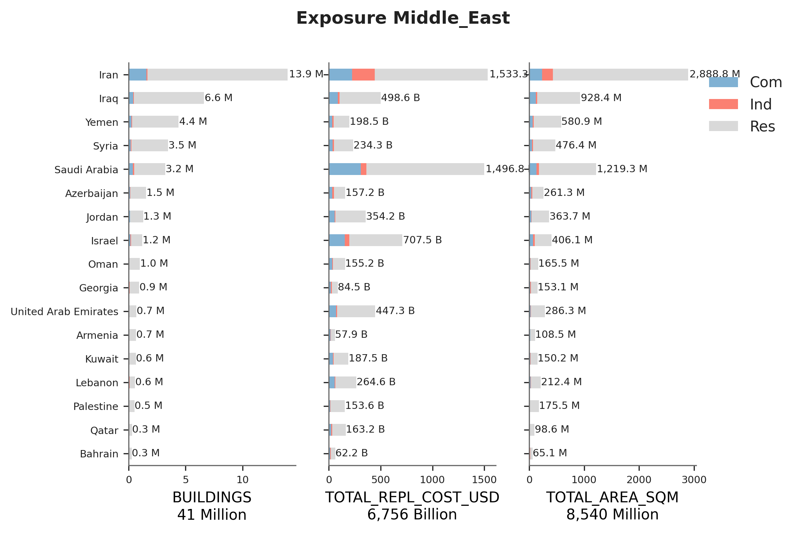

# Middle_East

## Metadata
|    | ID_0   | NAME_0               | OCCUPANCY   | DATA_SOURCES                                                                                                                                                    | PUBLISHER                                                                                                                                    |   DATA_YEAR |   ADM_LEVEL | VARIABLES              |   AVAILABLE_UPDATES | NOTES                                                                                                        | LINKS                                                                   |
|---:|:-------|:---------------------|:------------|:----------------------------------------------------------------------------------------------------------------------------------------------------------------|:---------------------------------------------------------------------------------------------------------------------------------------------|------------:|------------:|:-----------------------|--------------------:|:-------------------------------------------------------------------------------------------------------------|:------------------------------------------------------------------------|
|  0 | ARM    | Armenia              | RES         | ArmStat Statistical Yearbook 2022                                                                                                                               | nan                                                                                                                                          |        2022 |           1 | nan                    |                 nan | nan                                                                                                          | nan                                                                     |
|    |        |                      |             | Population and Housing Census 2011                                                                                                                              |                                                                                                                                              |             |             |                        |                     |                                                                                                              |                                                                         |
|    |        |                      |             | UNECE Armenia Housing Study 2010                                                                                                                                |                                                                                                                                              |             |             |                        |                     |                                                                                                              |                                                                         |
|  1 | ARM    | Armenia              | IND, COM    | OECD Compendium of Enterprise Statistics Armenia, 2018                                                                                                          | nan                                                                                                                                          |        2018 |           1 | nan                    |                 nan | nan                                                                                                          | nan                                                                     |
|  2 | AZE    | Azerbaijan           | RES         | AZSTAT 2021                                                                                                                                                     | nan                                                                                                                                          |        2018 |           1 | nan                    |                 nan | nan                                                                                                          | nan                                                                     |
|  3 | AZE    | Azerbaijan           | IND, COM    | Micro, small and medium entrepreneurship in Azerbaijan 2022                                                                                                     | nan                                                                                                                                          |        2022 |           1 | nan                    |                 nan | nan                                                                                                          | nan                                                                     |
|  4 | BHR    | Bahrain              | RES         | Census 2020                                                                                                                                                     | nan                                                                                                                                          |        2020 |           1 | nan                    |                 nan | nan                                                                                                          | nan                                                                     |
|    |        |                      |             | Census 2010                                                                                                                                                     |                                                                                                                                              |             |             |                        |                     |                                                                                                              |                                                                         |
|  5 | BHR    | Bahrain              | IND, COM    | Enterprise Survey, 2006                                                                                                                                         | nan                                                                                                                                          |        2010 |           1 | nan                    |                 nan | nan                                                                                                          | nan                                                                     |
|    |        |                      |             | Census 2010                                                                                                                                                     |                                                                                                                                              |             |             |                        |                     |                                                                                                              |                                                                         |
|  6 | GEO    | Georgia              | RES         | GEOSTAT 2021                                                                                                                                                    | nan                                                                                                                                          |        2021 |           1 | nan                    |                 nan | nan                                                                                                          | nan                                                                     |
|  7 | GEO    | Georgia              | IND, COM    | GEOSTAT Business Register 2022 - By regions                                                                                                                     | nan                                                                                                                                          |        2022 |           1 | nan                    |                 nan | nan                                                                                                          | nan                                                                     |
|    |        |                      |             | GEOSTAT Business Register 2021 - By kind of economic activity                                                                                                   |                                                                                                                                              |             |             |                        |                     |                                                                                                              |                                                                         |
|  8 | IRQ    | Iraq                 | RES         | Iraq Indicators and Figures 2012                                                                                                                                | nan                                                                                                                                          |        2012 |           1 | nan                    |                 nan | nan                                                                                                          | nan                                                                     |
|    |        |                      |             | UN-HABITAT Iraq National Housing Policy 2010                                                                                                                    |                                                                                                                                              |             |             |                        |                     |                                                                                                              |                                                                         |
|  9 | IRQ    | Iraq                 | IND, COM    | Large Industrial Establishments Statistics 2018                                                                                                                 | nan                                                                                                                                          |        2018 |           1 | nan                    |                 nan | nan                                                                                                          | nan                                                                     |
|    |        |                      |             | Medium Industrial Establishments Statistics 2014                                                                                                                |                                                                                                                                              |             |             |                        |                     |                                                                                                              |                                                                         |
| 10 | ISR    | Israel               | RES         | Population and Housing Census 2008                                                                                                                              | nan                                                                                                                                          |        2021 |           1 | nan                    |                 nan | nan                                                                                                          | nan                                                                     |
|    |        |                      |             | Construction & housing conditions in Israel 1985-2010                                                                                                           |                                                                                                                                              |             |             |                        |                     |                                                                                                              |                                                                         |
|    |        |                      |             | Construction Survey 2021                                                                                                                                        |                                                                                                                                              |             |             |                        |                     |                                                                                                              |                                                                         |
|    |        |                      |             | Labour Force Survey 2018                                                                                                                                        |                                                                                                                                              |             |             |                        |                     |                                                                                                              |                                                                         |
|    |        |                      |             | Statistical Abstract of Israel 2021                                                                                                                             |                                                                                                                                              |             |             |                        |                     |                                                                                                              |                                                                         |
| 11 | ISR    | Israel               | IND, COM    | Survey of Industries 2018                                                                                                                                       | nan                                                                                                                                          |        2018 |           1 | nan                    |                 nan | nan                                                                                                          | nan                                                                     |
| 12 | JOR    | Jordan               | RES         | Population and Housing Census 2015                                                                                                                              | nan                                                                                                                                          |        2015 |           1 | nan                    |                 nan | nan                                                                                                          | nan                                                                     |
|    |        |                      |             | Population and Housing Census 2011                                                                                                                              |                                                                                                                                              |             |             |                        |                     |                                                                                                              |                                                                         |
| 13 | JOR    | Jordan               | IND, COM    | Economic Establishments Census 2018                                                                                                                             | nan                                                                                                                                          |        2018 |           1 | nan                    |                 nan | nan                                                                                                          | nan                                                                     |
| 14 | KWT    | Kuwait               | RES         | Annual Statistics 2014                                                                                                                                          | nan                                                                                                                                          |        2021 |           1 | nan                    |                 nan | nan                                                                                                          | nan                                                                     |
|    |        |                      |             | Census 2011                                                                                                                                                     |                                                                                                                                              |             |             |                        |                     |                                                                                                              |                                                                         |
|    |        |                      |             | Population Estimates 2021                                                                                                                                       |                                                                                                                                              |             |             |                        |                     |                                                                                                              |                                                                         |
| 15 | KWT    | Kuwait               | IND, COM    | Labour Force Survey 2015                                                                                                                                        | nan                                                                                                                                          |        2018 |           1 | nan                    |                 nan | nan                                                                                                          | nan                                                                     |
|    |        |                      |             | Distribution of Establishments and Employees 1995                                                                                                               |                                                                                                                                              |             |             |                        |                     |                                                                                                              |                                                                         |
|    |        |                      |             | Small and Medium Enterprises in Kuwait 2018                                                                                                                     |                                                                                                                                              |             |             |                        |                     |                                                                                                              |                                                                         |
| 16 | LBN    | Lebanon              | RES         | Labour Force and Household Living Conditions Survey 2018-2019                                                                                                   | nan                                                                                                                                          |        2019 |           1 | nan                    |                 nan | nan                                                                                                          | nan                                                                     |
|    |        |                      |             | Living Conditions Survey 2007                                                                                                                                   |                                                                                                                                              |             |             |                        |                     |                                                                                                              |                                                                         |
| 17 | LBN    | Lebanon              | IND, COM    | Census of Buildings, Dwellings, and Establishments 2004                                                                                                         | nan                                                                                                                                          |        2004 |           1 | nan                    |                 nan | nan                                                                                                          | nan                                                                     |
| 18 | OMN    | Oman                 | RES         | Census 2010                                                                                                                                                     | nan                                                                                                                                          |        2020 |           1 | nan                    |                 nan | nan                                                                                                          | nan                                                                     |
|    |        |                      |             | Census 2020 - Press release                                                                                                                                     |                                                                                                                                              |             |             |                        |                     |                                                                                                              |                                                                         |
| 19 | OMN    | Oman                 | IND, COM    | Census 2020 - Press release                                                                                                                                     | nan                                                                                                                                          |        2020 |           1 | nan                    |                 nan | nan                                                                                                          | nan                                                                     |
|    |        |                      |             | Establishment Census 2010                                                                                                                                       |                                                                                                                                              |             |             |                        |                     |                                                                                                              |                                                                         |
| 20 | PSE    | Palestine            | RES         | Integrating Resilience in Local Governance in West Bank and Gaza (WB&G) project                                                                                 | Urban Planning and Disaster Risk Reduction Center (UPDRRC) of An-Najah National University for Municipal Development and Lending Fund (MDLF) |        2022 |           3 | nan                    |                 nan | Data provided from an external project                                                                       | nan                                                                     |
| 21 | PSE    | Palestine            | IND, COM    | Integrating Resilience in Local Governance in West Bank and Gaza (WB&G) project                                                                                 | Urban Planning and Disaster Risk Reduction Center (UPDRRC) of An-Najah National University for Municipal Development and Lending Fund (MDLF) |        2022 |           3 | nan                    |                 nan | Data provided from an external project                                                                       | nan                                                                     |
| 22 | QAT    | Qatar                | RES         | Main Results of the General Census of Population, Housing, and Establishments 2020                                                                              | nan                                                                                                                                          |        2020 |           1 | nan                    |                 nan | nan                                                                                                          | nan                                                                     |
|    |        |                      |             | Census 2015                                                                                                                                                     |                                                                                                                                              |             |             |                        |                     |                                                                                                              |                                                                         |
|    |        |                      |             | Census 1997                                                                                                                                                     |                                                                                                                                              |             |             |                        |                     |                                                                                                              |                                                                         |
| 23 | QAT    | Qatar                | IND, COM    | Main Results of the General Census of Population, Housing, and Establishments 2020                                                                              | nan                                                                                                                                          |        2020 |           1 | nan                    |                 nan | nan                                                                                                          | nan                                                                     |
|    |        |                      |             | The Annual Bulletin of Building and Construction Statistics 2016                                                                                                |                                                                                                                                              |             |             |                        |                     |                                                                                                              |                                                                         |
|    |        |                      |             | Census 2015                                                                                                                                                     |                                                                                                                                              |             |             |                        |                     |                                                                                                              |                                                                         |
| 24 | SAU    | Saudi Arabia         | RES         | Census 2010                                                                                                                                                     | nan                                                                                                                                          |        2020 |           1 | nan                    |                 nan | nan                                                                                                          | nan                                                                     |
|    |        |                      |             | Census 2020 - Press release                                                                                                                                     |                                                                                                                                              |             |             |                        |                     |                                                                                                              |                                                                         |
| 25 | SAU    | Saudi Arabia         | IND, COM    | Establishments Economic Survey 2017                                                                                                                             | nan                                                                                                                                          |        2017 |           1 | nan                    |                 nan | nan                                                                                                          | nan                                                                     |
|    |        |                      |             | Census 2010                                                                                                                                                     |                                                                                                                                              |             |             |                        |                     |                                                                                                              |                                                                         |
| 26 | SYR    | Syria                | RES         | UN-HABITAT Syria Country Porfile 2016                                                                                                                           | nan                                                                                                                                          |        2016 |           1 | nan                    |                 nan | nan                                                                                                          | nan                                                                     |
|    |        |                      |             | World Housing Encyclopedia                                                                                                                                      |                                                                                                                                              |             |             |                        |                     |                                                                                                              |                                                                         |
| 27 | SYR    | Syria                | IND, COM    | nan                                                                                                                                                             | nan                                                                                                                                          |        2019 |           0 | nan                    |                 nan | National statistics not found; used International Labour Organization (ILO) estimates for 2019               | nan                                                                     |
| 28 | ARE    | United Arab Emirates | RES         | Census 2005                                                                                                                                                     | nan                                                                                                                                          |        2016 |           1 | nan                    |                 nan | nan                                                                                                          | nan                                                                     |
|    |        |                      |             | Population Statistics 2016                                                                                                                                      |                                                                                                                                              |             |             |                        |                     |                                                                                                              |                                                                         |
| 29 | ARE    | United Arab Emirates | IND, COM    | Ministry of Economy Annual Statistical Report 2019                                                                                                              | nan                                                                                                                                          |        2019 |           1 | nan                    |                 nan | nan                                                                                                          | nan                                                                     |
|    |        |                      |             | Ministry of Economy Annual Economic Report 2016                                                                                                                 |                                                                                                                                              |             |             |                        |                     |                                                                                                              |                                                                         |
|    |        |                      |             | Statistical Yearbook 2017                                                                                                                                       |                                                                                                                                              |             |             |                        |                     |                                                                                                              |                                                                         |
| 30 | YEM    | Yemen                | RES         | Statistical Year Book 2017                                                                                                                                      | nan                                                                                                                                          |        2017 |           1 | nan                    |                 nan | nan                                                                                                          | nan                                                                     |
| 31 | YEM    | Yemen                | IND, COM    | Statistical Year Book 2017                                                                                                                                      | nan                                                                                                                                          |        2017 |           1 | nan                    |                 nan | nan                                                                                                          | nan                                                                     |
|    |        |                      |             | Census 2004                                                                                                                                                     |                                                                                                                                              |             |             |                        |                     |                                                                                                              |                                                                         |
|    |        |                      |             | Labour Force Survey 2013-4                                                                                                                                      |                                                                                                                                              |             |             |                        |                     |                                                                                                              |                                                                         |
| 32 | IRN    | Iran                 | RES         | Population and Housing Census                                                                                                                                   | Statistical Centre of Iran (SCI)                                                                                                             |        2011 |           1 | Dwelling type          |                2016 | The original census information at ADM1 is in Farsi and was translated with the help of a local collaborator | https://irandataportal.syr.edu/2011-census                              |
|    |        |                      |             |                                                                                                                                                                 |                                                                                                                                              |             |             | Construction material  |                     |                                                                                                              |                                                                         |
|    |        |                      |             |                                                                                                                                                                 |                                                                                                                                              |             |             | Year of construction   |                     |                                                                                                              |                                                                         |
| 33 | IRN    | Iran                 | COM         | Iran Statistical Yearbooks:                                                                                                                                     | Statistical Centre of Iran (SCI)                                                                                                             |        2012 |           1 | Economic sector        |                2016 | nan                                                                                                          | https://irandataportal.syr.edu/socio-economic-data/statistical-yearbook |
|    |        |                      |             | Trade, Hotels and Restaurants,                                                                                                                                  |                                                                                                                                              |             |             | Number of enterprises  |                     |                                                                                                              |                                                                         |
|    |        |                      |             | Transport, Storage and Communications, Culture and Tourism, International Statistics, Labour Force                                                              |                                                                                                                                              |             |             | Size of enterprises    |                     |                                                                                                              |                                                                         |
| 34 | IRN    | Iran                 | IND         | Iran Statistical Yearbooks:                                                                                                                                     | Statistical Centre of Iran (SCI)                                                                                                             |        2012 |           1 | Industry               |                2016 | nan                                                                                                          | https://irandataportal.syr.edu/socio-economic-data/statistical-yearbook |
|    |        |                      |             | Mining and Quarrying, Agriculture, Forestry and Fisheries, Water and Electricity, Transport, Storage and Communications, International Statistics, Labour Force |                                                                                                                                              |             |             | Number of enterprises  |                     |                                                                                                              |                                                                         |
|    |        |                      |             |                                                                                                                                                                 |                                                                                                                                              |             |             | Size of enterprises    |                     |                                                                                                              |                                                                         |

    