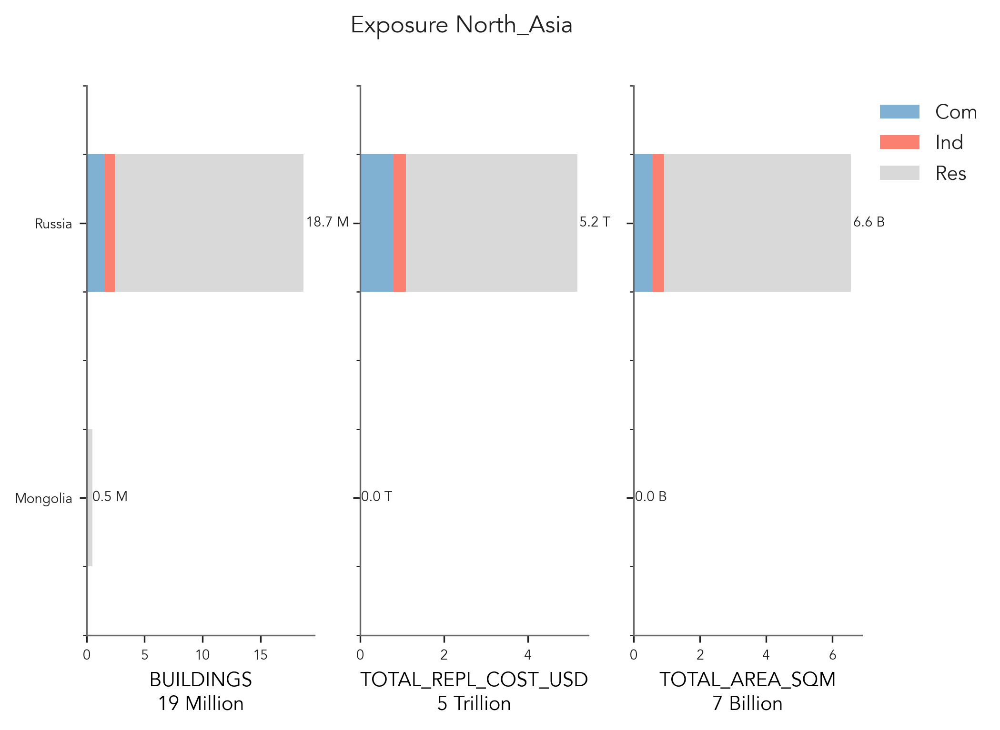
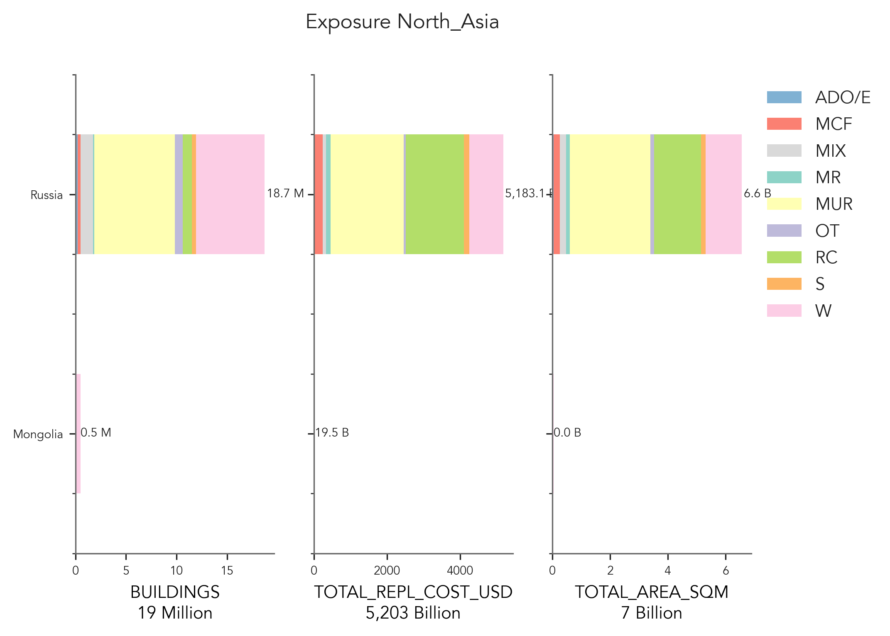

# North_Asia

## Metadata
|    | ID_0   | NAME_0   | OCCUPANCY   | DATA_SOURCES                                                                                                                                                 | PUBLISHER                                      |   DATA_YEAR | ADM_LEVEL      | VARIABLES                                        | NOTES                                                                                                                                                     | LINKS                                                       |
|---:|:-------|:---------|:------------|:-------------------------------------------------------------------------------------------------------------------------------------------------------------|:-----------------------------------------------|------------:|:---------------|:-------------------------------------------------|:----------------------------------------------------------------------------------------------------------------------------------------------------------|:------------------------------------------------------------|
|  0 | MNG    | Mongolia | RES         | Population and Housing Census                                                                                                                                | National Statistics Office of Mongolia         |        2020 | 2              | nan                                              | nan                                                                                                                                                       | https://www.1212.mn/en/statistic/file-library/view/47811341 |
|  1 | MNG    | Mongolia | RES         | Tumurbaatar, Z.; Miura, H.; Tsamba, T. Development of Building Inventory Data in Ulaanbaatar, Mongolia for Seismic Loss Mongolia for Seismic Loss Estimation | ISPRS International Journal of Geo-Information |        2022 | Building-level | nan                                              | nan                                                                                                                                                       | https://www.mdpi.com/2220-9964/11/1/26                      |
|  2 | MNG    | Mongolia | IND, COM    | Establishment Census                                                                                                                                         | National Statistics Office of Mongolia         |        2016 | 2              | nan                                              | nan                                                                                                                                                       | nan                                                         |
|  3 | MNG    | Mongolia | IND, COM    | Report of Labor Force Survey                                                                                                                                 | National Statistics Office of Mongolia         |        2020 | 2              | nan                                              | nan                                                                                                                                                       | nan                                                         |
|  4 | RUS    | Russia   | RES         | Russia in Numbers 2019                                                                                                                                       | Federal State Statistics Service (Rosstat)     |        2019 | 1              | Residence type                                   | Wall material data was taken from the 2010 Census, whereas more recent statistics spanning different years (e.g., 2019, 2020, 2021) were available online | https://rosstat.gov.ru/                                     |
|    |        |          |             | Russian Census 2010                                                                                                                                          |                                                |             |                | Wall materials                                   |                                                                                                                                                           |                                                             |
|    |        |          |             |                                                                                                                                                              |                                                |             |                | Average apartment areas                          |                                                                                                                                                           |                                                             |
|    |        |          |             |                                                                                                                                                              |                                                |             |                | Average construction cost                        |                                                                                                                                                           |                                                             |
|  5 | RUS    | Russia   | IND, COM    | Russia in Numbers 2019                                                                                                                                       | Federal State Statistics Service (Rosstat)     |        2019 | 1              | Average annual employment by economic activities | Admin level 1 in this case referring to economic regions                                                                                                  | https://rosstat.gov.ru/                                     |
|    |        |          |             |                                                                                                                                                              |                                                |             |                | Number of organizations by economic activities   |                                                                                                                                                           |                                                             |
|    |        |          |             |                                                                                                                                                              |                                                |             |                | Number of active enterprises                     |                                                                                                                                                           |                                                             |

    