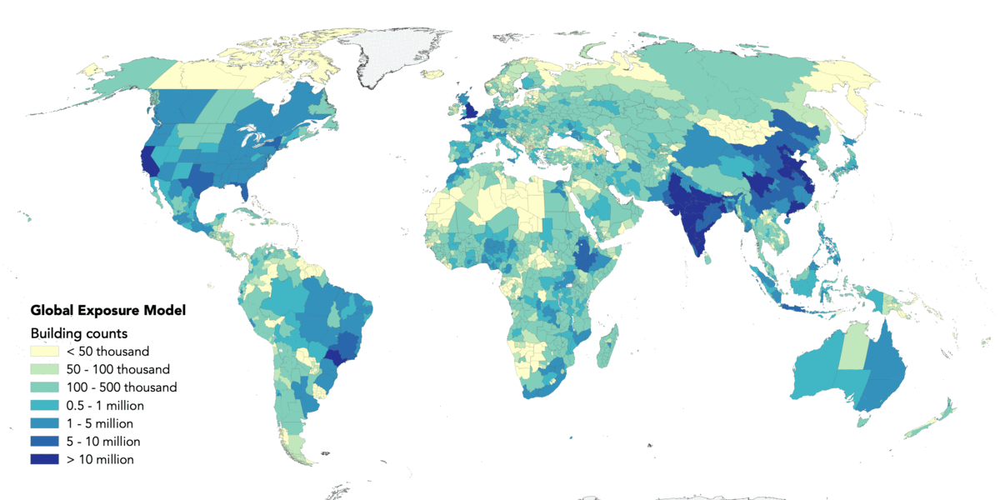
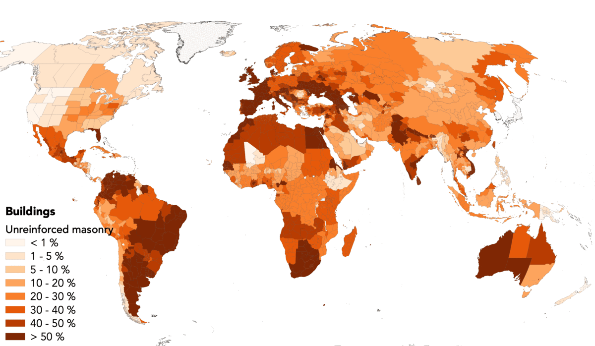
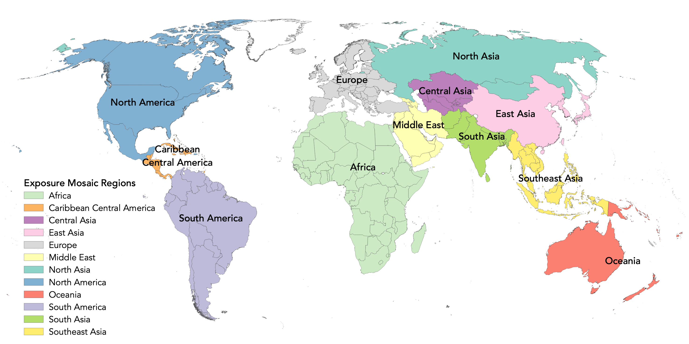

# Global Exposure Model

# ✨ Overview

> The v2023.0.0 release for the GEM's global exposure model is available! 🥳 🚀

This repository hosts the exposure information for the world.
It includes figures, summaries and data for each country, for the region (see [Region and country list](#-region-and-country-list)), and for the world.

Global Exposure Model

Global Exposure Model macro-taxonomy

For each country the information includes:
- Summary of exposure model at national level 
- Exposure model at the first administrative level
- Summary of the exposure model aggregated per building class (taxonomy)
- Figures for buildings, total replacement cost, and built up area dissagregated per occupancy type, macrotaxonomy at national level and at the first administrative level
- Folder with mapping-schemes used to associated building counts to different building classes)

At regional level, information includes:
- Metadata
- Summary of regional counts and summaries per macrotaxonomy
- Figures for buildings, total replacement cost, and built up area dissagregated per occupancy type and macrotaxonomy

# 🚀 Model versions  

Each version of the model that is released can be accessed by changing from the `main` branch to the `tag` of a given version.
The `main` branch could contain the work-in-progress of the next version of the model.

| Version   | Release Notes                                                            |
|-----------|--------------------------------------------------------------------------|
| v2018.0.0 | Original version within the larger 2018 Global Risk Model release.       |
| [v2022.0.0](https://github.com/gem/global_exposure_model/tree/v2022.0.0) | Improvements of the global exposure model, compared with the v2018.0.0, include: <ul><li>Building counts and replacement costs updated to 2021 values (include updates in dwelling and establishment counts, mapping schemes, average area, number of stories, replacement cost, code and expected ductility level.</li><li>Reviewd non-res models to improve spatial distribution</li></ul> |
| [v2023.0.0](https://github.com/gem/global_exposure_model/tree/v2023.0.0) | Minor revision relative to `v2022.0.0`: Population distributed across day, night, and transit time periods. Few country specific updates.|

# 🌍 Region and country list

  

The following regions and countries are covered in this repository. 

| REGION                    | COUNTRIES |
|---------------------------|-----------|
| Africa                    | Algeria, Angola, Benin, Botswana, Burkina_Faso, Burundi, Cameroon, Cape_Verde, Central_African_Republic, Chad, Comoros, Congo, Democratic_Republic_of_the_Congo, Djibouti, Egypt, Equatorial_Guinea, Eritrea, Eswatini, Ethiopia, Gabon, Gambia, Ghana, Guinea, Guinea_Bissau, Ivory_Coast, Kenya, Lesotho, Liberia, Libya, Madagascar, Malawi, Mali, Mauritania, Mauritius, Morocco, Mozambique, Namibia, Niger, Nigeria, Rwanda, Sao_Tome_and_Principe, Senegal, Seychelles, Sierra_Leone, Somalia, South_Africa, South_Sudan, Sudan, Tanzania, Togo, Tunisia, Uganda, Zambia, Zimbabwe |
| Caribbean_Central_America | Anguilla, Antigua_and_Barbuda, Aruba, Bahamas, Barbados, Belize, British_Virgin_Islands, Cayman_Islands, Costa_Rica, Cuba, Dominica, Dominican_Republic, El_Salvador, Grenada, Guadeloupe, Guatemala, Haiti, Honduras, Jamaica, Martinique, Montserrat, Nicaragua, Panama, Puerto_Rico, Saint_Kitts_and_Nevis, Saint_Lucia, Saint_Vincent_and_the_Grenadines, Trinidad_and_Tobago, Turks_and_Caicos_Islands, US_Virgin_Islands |
| Central_Asia              | Kazakhstan, Kyrgyzstan, Tajikistan, Turkmenistan, Uzbekistan |
| East_Asia                 | China, Hong_Kong, Japan, Macao, North_Korea, South_Korea, Taiwan |
| Europe                    | Albania, Andorra, Austria, Belarus, Belgium, Bosnia_and_Herzegovina, Bulgaria, Croatia, Cyprus, Czechia, Denmark, Estonia, Finland, France, Germany, Gibraltar, Greece, Hungary, Iceland, Ireland, Isle_of_Man, Italy, Kosovo, Latvia, Liechtenstein, Lithuania, Luxembourg, Malta, Moldova, Monaco, Montenegro, Netherlands, North_Macedonia, Norway, Poland, Portugal, Romania, Serbia, Slovakia, Slovenia, Spain, Sweden, Switzerland, Turkey, Ukraine, United_Kingdom |
| Middle_East               | Afghanistan, Armenia, Azerbaijan, Bahrain, Georgia, Iran, Iraq, Israel, Jordan, Kuwait, Lebanon, Oman, Pakistan, Palestine, Qatar, Saudi_Arabia, Syria, United_Arab_Emirates, Yemen |
| North_America             | Canada, Mexico, United_States_of_America |
| North_Asia                | Mongolia, Russia |
| Oceania                   | American_Samoa, Australia, Cook_Islands, Fiji, Guam, Kiribati, Marshall_Islands, Micronesia, Nauru, New_Caledonia, New_Zealand, Niue, Northern_Mariana_Islands, Palau, Papua_New_Guinea, Samoa, Solomon_Islands, Tonga, Tuvalu, Vanuatu |
| South_America             | Argentina, Bolivia, Brazil, Chile, Colombia, Ecuador, French_Guiana, Guyana, Paraguay, Peru, Suriname, Uruguay, Venezuela |
| South_Asia                | Afghanistan, Bangladesh, Bhutan, India, Nepal, Pakistan, Sri_Lanka |
| Southeast_Asia            | Brunei, Cambodia, Indonesia, Laos, Malaysia, Myanmar, Philippines, Singapore, Thailand, Timor_Leste, Vietnam |

# 📚 Publications

Please cite the work as follows:
<!-- ---

!!!TO BE ADDED!!!

--- -->

# 🌟 Contributors 

The authors are grateful for the input from dozens of local and international experts. A list of contributors can be found at https://www.globalquakemodel.org/risk-model-contributors.

# License
Shield: [![CC BY-NC-SA 4.0][cc-by-nc-sa-shield]][cc-by-nc-sa]

This work is licensed under a
[Creative Commons Attribution-NonCommercial-ShareAlike 4.0 International License][cc-by-nc-sa].

[![CC BY-NC-SA 4.0][cc-by-nc-sa-image]][cc-by-nc-sa]

[cc-by-nc-sa]: http://creativecommons.org/licenses/by-nc-sa/4.0/
[cc-by-nc-sa-image]: https://licensebuttons.net/l/by-nc-sa/4.0/88x31.png
[cc-by-nc-sa-shield]: https://img.shields.io/badge/License-CC%20BY--NC--SA%204.0-lightgrey.svg

# 🤔 Frequently asked questions 

### Which version am I seeing? How to change the version?
By default you will see the files in the repository in the  `main` branch. Each version of the model that is released can be accessed is marked with a `tag`. By changing the tag version at the top of the repository, you can change see the files for a given version.

Note that the `main` branch could contain the work-in-progress of the next version of the model.

### How do I download the data for a given version?
For each version, a related zip file is availabe: release zip file downloads.

### Where can I find additional information on the defined building classes?

The building classes defined within this exposure model follow the GEM Taxonomy convention. Please refer to the [GEM Taxonomy Glossary](https://taxonomy.openquake.org/) for additional details on taxonomy substrings.

### Where can I find the models at the smallest available resolution?

Please contact us at product@globalquakemodel.org