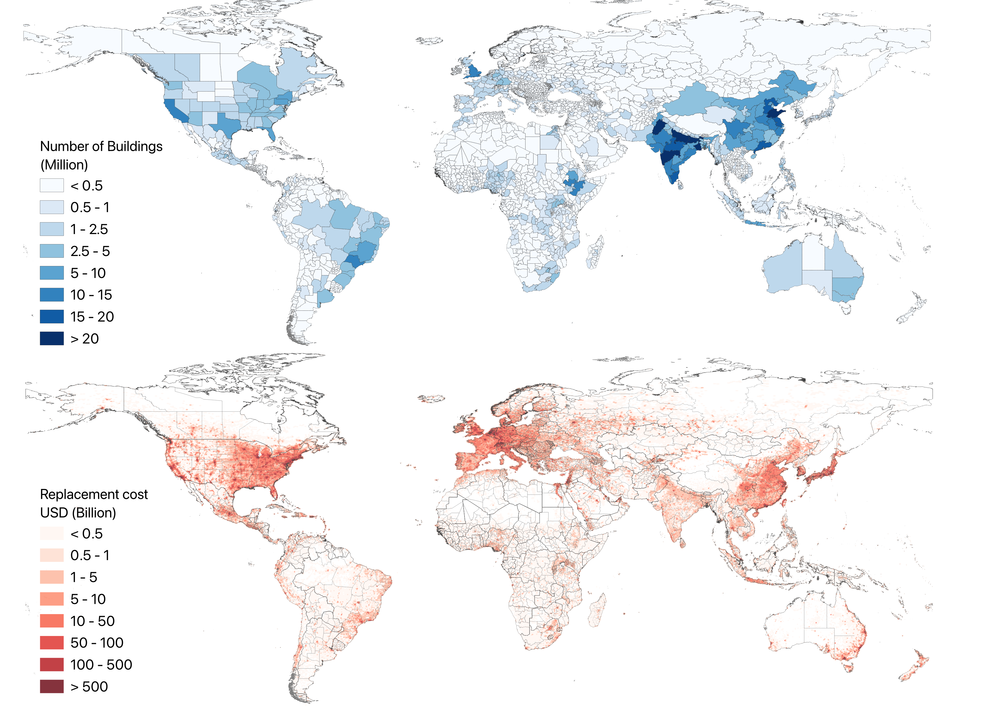
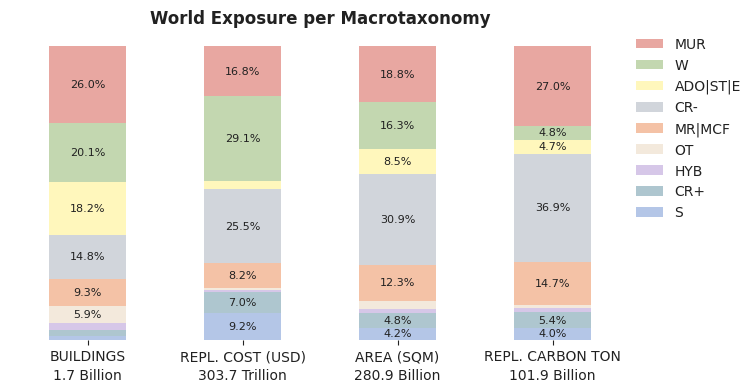
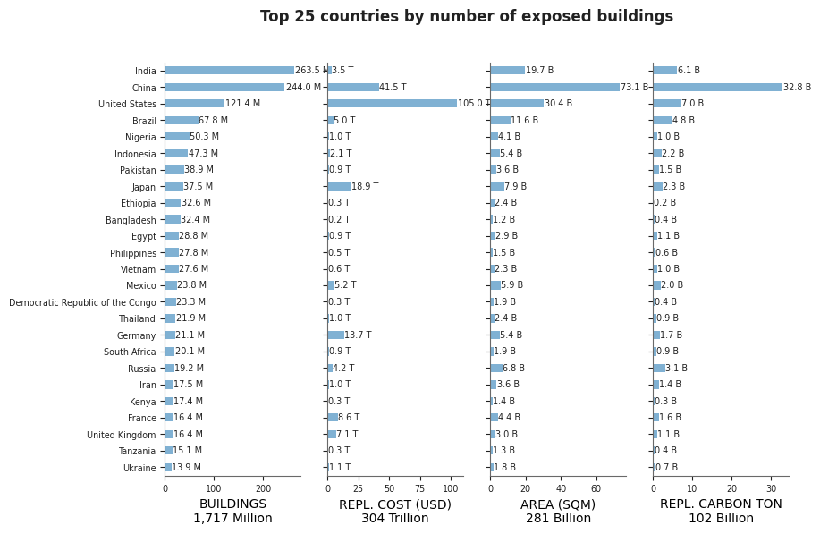
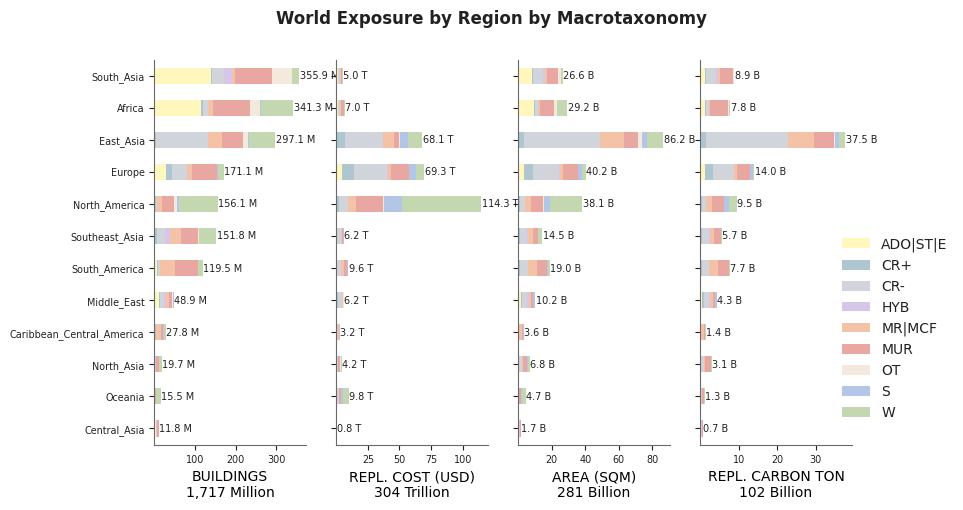
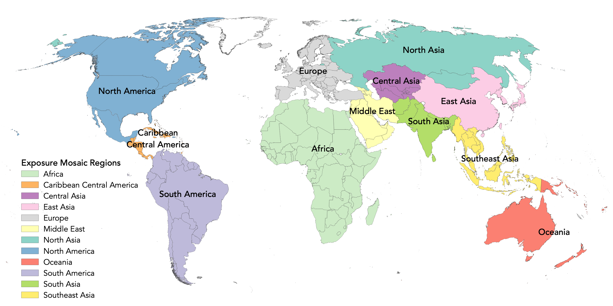

# Global Exposure Model

## ✨ Overview

> The `v2026.0.0` release for the GEM's global exposure model is now available! 🥳 🚀

<!-- Map with national buildings -->

_Figure: Exposure model. Number of building at the first-administrative devision (top), and spatial distribution of building counts aggregated onto a discrete hexagonal grid (bottom)_

GEM's Global Exposure Model covers 215 countries and territories. Exposure model  insights help governments, insurers, and disaster response teams anticipate and mitigate earthquake impacts.

### 👥 Population and Building classes
  - 📍 Around 50% of the world population (~4.1 billion people) lives in areas exposed to moderate to high levels of seismic hazard (PGA > 0.10g on rock).
  - 🏠 Almost half of the buildings in the world are made of unreinforced masonry (26%) or wood (20%).
  - 🇮🇳 India accounts for the largest share of the global building stock, with an estimated 264 million buildings.
  
### 💰 Economic value of Buildings
  - 🔢 $304 trillion is the estimated total replacement cost of buildings (residential, commercial and industrial) worldwide, based on our latest risk models.
  - 🇺🇸 The United States of America concentrates the largest replacement cost, with $105 trillion.
  - 🌎 >80% of the total replacement cost is concentrated in three regions: North America, East Asia, and Europe.

### 🏠 Buildings Vulnerability
  - 🚶‍♂️ More than 70% of the population in the world lives in buildings with no seismic provisions (vulnerable to earthquakes).
  - 🔨 <10% of the buildings follow modern building codes with moderate to high earthquake performance standards.

<!-- Figures -->

_Figure: Global distribution of exposure by macro-taxonomy._

_Figure: Top 25 countries by number of exposed buildings._

_Figure: Global exposure by region and macrotaxonomy._

## 📂 Data structure

The GEM Global Exposure Model is organized into a mosaic of exposure regions. Although these regions generally follow widely recognized geographic conventions, some adaptations were made to ensure consistency with the [GEM Global Mosaic of Seismic Hazard Models](https://hazard.openquake.org/gem/models/). The model outputs are structured hierarchically by region, country, and territory.

_Figure: Mosaic of exposure and risk regions_

  
👀 click to see country list

| REGION                    | COUNTRIES |
|---------------------------|-----------|
| Africa                    | Algeria, Angola, Benin, Botswana, Burkina Faso, Burundi, Cameroon, Cape Verde, Central African Republic, Chad, Comoros, Congo, Democratic Republic of the Congo, Djibouti, Egypt, Equatorial Guinea, Eritrea, Eswatini, Ethiopia, Gabon, Gambia, Ghana, Guinea, Guinea Bissau, Ivory Coast, Kenya, Lesotho, Liberia, Libya, Madagascar, Malawi, Mali, Mauritania, Mauritius, Morocco, Mozambique, Namibia, Niger, Nigeria, Rwanda, Sao Tome and Principe, Senegal, Seychelles, Sierra Leone, Somalia, South Africa, South Sudan, Sudan, Tanzania, Togo, Tunisia, Uganda, Zambia, Zimbabwe |
| Caribbean Central America | Anguilla, Antigua and Barbuda, Aruba, Bahamas, Barbados, Belize, British Virgin Islands, Cayman Islands, Costa Rica, Cuba, Dominica, Dominican Republic, El Salvador, Grenada, Guadeloupe, Guatemala, Haiti, Honduras, Jamaica, Martinique, Montserrat, Nicaragua, Panama, Puerto Rico, Saint Kitts and Nevis, Saint Lucia, Saint Vincent and the Grenadines, Trinidad and Tobago, Turks and Caicos Islands, US Virgin Islands |
| Central Asia              | Kazakhstan, Kyrgyzstan, Tajikistan, Turkmenistan, Uzbekistan |
| East Asia                 | China, Hong Kong, Japan, Macao, North Korea, South Korea, Taiwan |
| Europe                    | Albania, Andorra, Austria, Belarus, Belgium, Bosnia and Herzegovina, Bulgaria, Croatia, Cyprus, Czechia, Denmark, Estonia, Finland, France, Germany, Gibraltar, Greece, Hungary, Iceland, Ireland, Isle of Man, Italy, Kosovo, Latvia, Liechtenstein, Lithuania, Luxembourg, Malta, Moldova, Monaco, Montenegro, Netherlands, North Macedonia, Norway, Poland, Portugal, Romania, Serbia, Slovakia, Slovenia, Spain, Sweden, Switzerland, Turkey, Ukraine, United Kingdom |
| Middle East               | Afghanistan, Armenia, Azerbaijan, Bahrain, Georgia, Iran, Iraq, Israel, Jordan, Kuwait, Lebanon, Oman, Pakistan, Palestine, Qatar, Saudi Arabia, Syria, United Arab Emirates, Yemen |
| North America             | Canada, Mexico, United States of America |
| North Asia                | Mongolia, Russia |
| Oceania                   | American Samoa, Australia, Cook Islands, Fiji, Guam, Kiribati, Marshall Islands, Micronesia, Nauru, New Caledonia, New Zealand, Niue, Northern Mariana Islands, Palau, Papua New Guinea, Samoa, Solomon Islands, Tonga, Tuvalu, Vanuatu |
| South America             | Argentina, Bolivia, Brazil, Chile, Colombia, Ecuador, French Guiana, Guyana, Paraguay, Peru, Suriname, Uruguay, Venezuela |
| South Asia                | Afghanistan, Bangladesh, Bhutan, India, Nepal, Pakistan, Sri Lanka |
| Southeast Asia            | Brunei, Cambodia, Indonesia, Laos, Malaysia, Myanmar, Philippines, Singapore, Thailand, Timor Leste, Vietnam |

A `World` directory contains the global results, while each regional directory contains subdirectories for the countries and territories within that region. Each country or territory directory includes the following information:

- **Summaries:** CSV tables and figures summarizing building exposure at the national (Adm0), subnational (Adm1), and taxonomy levels.
- **Exposure model:** Spatially disaggregated building exposure at 0.01 degrees (approximately 1km) resolution in `csv.gz` format, available for residential (RES), commercial (COM), and industrial (IND) occupancy classes.
- `Vulnerability_mapping_ISO3.csv`: Vulnerability mapping  file per country or territory.

For more information, visit the [GEM Global Risk Model documentation](https://docs.openquake.org/global_risk_model/) site.
Spatially disaggregated models are also available and can be accessed by submitting a request through the [GEM License Request page](https://www.globalquakemodel.org/license-request/global-exposure-model).

## 🚀 Model versions

Each version of the model that is released can be accessed by changing from the `main` branch to the `tag` of a given version.
The `main` branch could contain the work-in-progress of the next version of the model.
[Check out here how to change the version](#which-version-am-i-seeing-how-to-change-the-version)

Within each regional directory, detailed descriptions of model updates and revisions are provided in the `CHANGELOG.md` file located at the root of the region's directory.

| Version   | Release Notes |
| --------- | -------------- |
| [v2026.0.0](https://github.com/gem/global_exposure_model/Exposure/tree/v2026.0.0) | Official GEM 2026 Global Release. Major update. See summary of changes in [CHANGELOG.md](./CHANGELOG.md). |
| [v2025.0.0](https://github.com/gem/global_exposure_model/Exposure/tree/v2025.0.0) | Internal release adding updated country models |
| [v2023.1.0](https://github.com/gem/global_exposure_model/Exposure/tree/v2023.1.0) | Official June 2023 GEM Global Risk Model release. Updates include taxonomy consistency improvements, boundary-name revisions, exposure spatially disaggregated for many countries. |
| [v2023.0.0](https://github.com/gem/global_exposure_model/Exposure/tree/v2023.0.0) | Minor revision relative to `v2022.0.0`, introducing population distribution across day, night, and transit periods, together with a small number of country-specific updates. |
| [v2022.0.0](https://github.com/gem/global_exposure_model/Exposure/tree/v2022.0.0) | Major update relative to `v2018.0.0`, including 2021 building counts and replacement costs, revised dwelling and establishment counts, mapping schemes, floor areas, story counts, building code levels, expected ductility levels, and improvements to the spatial distribution of non-residential exposure. |
| [v2018.0.0](https://github.com/gem/global_exposure_model/Exposure/tree/v2018.0.0) | Original version released as part of the 2018 Global Risk Model. |

## 🌟 Contributors

The authors are grateful for the input from dozens of local and international experts. A list of contributors can be found at https://www.globalquakemodel.org/risk-model-contributors.

## 📚 Publications

If you make use of this work, please cite both the publication and the data.

**Publications:**

Yepes-Estrada, C., Calderon, A., Costa, C., Crowley, H., Dabbeek, J., Hoyos, M., Martins, L., Paul, N., Rao, A., Silva, V. (2023). Global Building Exposure Model for Earthquake Risk Assessment. Earthquake Spectra. [doi:10.1177/87552930231194048]( https://doi.org/10.1177/87552930231194048)

**Data:**

Yepes-Estrada, C., Baiguera, M., Calderon, A., Caruso, M., Costa, C., Gonzalez, D., Nafeh, A.M.B., Rao, A., Silva, V. (2026). Global Exposure Model (2026.0.0). [doi.org/10.5281/zenodo.8117363](https://doi.org/10.5281/zenodo.8117363) 

### Regional and national model references

- Africa: Paul et al. (2022)[^10]
- Australia: Dunford and Power (2014)[^5]
- Canada: Journeay et al. (2022)[^7]
- Central America: Calderon et al. (2022)[^2]
- Central Asia: Pittore et al. (2020)[^11]
- China: Ma et al. (2021)[^8]
- Costa Rica: Calderon et al. (2019)[^1]
- Europe: Crowley et al. (2020)[^3]
- GED4GEM: Gamba et al. (2012)[^6]
- India: Rao et al. (2020)[^12]
- Iran: Motamed at al. (2019)[^9]
- Middle East: Dabbeek and Silva (2020)[^4]
- South America: Yepes-Estrada et al. (2017)[^15]
- Turkey: Rao et al. (2021)[^13]
- United States: FEMA (2024)[^14]

## ⚖️ License

[![CC BY-NC-SA 4.0][cc-by-nc-sa-shield]][cc-by-nc-sa]

This work is licensed under a
[Creative Commons Attribution-NonCommercial-ShareAlike 4.0 International License][cc-by-nc-sa], which requires:

* Attribution (you must give appropriate credit, provide a link to the license, and indicate if changes were made)
* Non-commercial (you may not use the material for commercial purposes)
* ShareAlike (derivatives created must be made available under the same license as the original)

If your use case deviates from the requirements of the offered license, but still want to explore the use of the data, please contact us at license@globalquakemodel.org  

[![CC BY-NC-SA 4.0][cc-by-nc-sa-image]][cc-by-nc-sa]

[cc-by-nc-sa]: http://creativecommons.org/licenses/by-nc-sa/4.0/
[cc-by-nc-sa-image]: https://licensebuttons.net/l/by-nc-sa/4.0/88x31.png
[cc-by-nc-sa-shield]: https://img.shields.io/badge/License-CC%20BY--NC--SA%204.0-lightgrey.svg

Any deviation from these terms incurs license infringement. For commercial use of the data contained within this work, a specific license agreement must be made tailored to your use case, in such instance please contact GEM at product@globalquakemodel.org.

## 🤔 Frequently Asked Questions (FAQs)

### Which version am I seeing? How to change the version?

By default you will see the files in the repository in the `main` branch. Each version of the model that is released is marked with a `tag`. By changing the tag version at the top of the repository, you can see the files for a given version.

Note that the `main` branch could contain the work-in-progress of the next version of the model.

### How do I download the data for a given version?

For each version, a released zip file is available: [release zip file downloads](https://github.com/gem/global_exposure_model/Exposure/releases/).

### Where can I find additional information on the defined building classes?

The building classes defined within this exposure model follow the [GEM Building Taxonomy v4.0](https://tools.openquake.org/taxonomy/). The link provides additional details on taxonomy substrings, images and detailed description of each attribute.

Building classes are mapped to corresponding vulnerability functions available in the [GEM's Global Vulnerability Model](https://github.com/gem/global_vulnerability_model). Inside each country there is available a `Vulnerability_mapping_ISO3.csv` file useful for earthquake risk assessment using the OpenQuake engine.

### What do the column headers mean?

Definitions and descriptions of the columns in the exposure summary tables.

  
👀 click to see definitions and descriptions

| HEADER | DESCRIPTION |
|---|---|
| ASSET_ID | Unique identifier for an asset, which comprises a group of buildings sharing similar attributes and location |
| ID_0 | ISO3 code for the country |
| NAME_0 | English name for the country |
| ID_1 | ID for the first administrative level, matches either the ID used in the national census or in the administrative division boundary vector files, or both |
| NAME_1 | Name of the first administrative level |
| ID_i | ID for the "ith" administrative level |
| NAME_i | Name of the "ith" administrative level |
| LONGITUDE | Geographical longitude cordinate of the asset location. In general, these locations do not represent building-specific geolocations, they represent points as a result of a spatial disaggregation algorithm (and thus still represent aggregated assets) but at a finer resolution. |
| LATITUDE | Geographical latitude cordinate of the asset location. In general, these locations do not represent building-specific geolocations, they represent points as a result of a spatial disaggregation algorithm (and thus still represent aggregated assets) but at a finer resolution. |
| OCCUPANCY | Primary occupancy class (RES: residential; COM: commercial; IND: industrial) |
| OCCUPANCY_TYPE | Detailed occupancy providing a finer classification within the primary OCCUPANCY class, describing the specific functional use of the structure as defined in the GEM taxonomy (e.g., [RES:1] single dwelling; [COM:3C] hotels and motels; [IND:2] light-industry factories). |
| SETTLEMENT | Type of settlement (e.g., URBAN, RURAL, SUBURBAN, URBAN_CENTER) |
| TAXONOMY | Building taxonomy string that is used for mapping vulnerability functions for the asset |
| TAXONOMY_HAZUS | Building taxonomy string compatible with HAZUS classification |
| MACRO_TAXONOMY | High-level classification of building types used in the Global Exposure Model for statistical analysis |
| BUILDINGS | The total number of buildings comprising the asset. A building unit is defined as a permanent, separate, and independent structure designed to serve any activity. For constructions comprising blocks, terraced buildings, or buildings enclosed by common fencing, a building unit refers to the superstructure that is structurally designed to respond independently under seismic loads |
| DWELLINGS | The total number of dwellings comprising the asset.  A dwelling unit is defined as a self-contained residential space within a building designed for habitation by one or more individuals or families. For example, a multi-story residential building is comprised of numerous dwelling units, such as multiple apartments within the same structure. Conversely, in a single-family detached unit, the number of dwelling units and buildings is the same |
| ESTABLISHMENTS | The total number of establishments comprising the asset. An establishment is defined as a single physical location where economic activities occur (e.g., services or industrial operations). An establishment is often characterized by having a specific address, management, and operational control, distinct from other units of the same company or organization. |
| OCCUPANTS_TOTAL | The number of residents in each residential asset |
| OCCUPANTS_DAY | The average number of occupants in each asset during the day-time period |
| OCCUPANTS_TRANSIT | The average number of occupants in each asset during the transit time period |
| OCCUPANTS_NIGHT | The average number of occupants in each asset during the night-time period |
| OCCUPANTS_AVERAGE | The time-averaged number of occupants in each asset (residential, commercial, industrial) |
| AVG_DWL_AREA_SQM | Floor area of a dwelling unit (sqm) |
| TOTAL_AREA_SQM | The total floor area comprising the asset (sqm) |
| COST_PER_AREA_USD | The average building cost (as built) per unit area (in US dollars). It includes the structural and nonstructural components, but not the building contents. |
| COST_PER_AREA_LOCAL | Idem as COST_PER_AREA_USD but using the local currency |
| BLDG_REPL_COST_USD | Cost to construct or replace the building components (structural and nonstructural) of  the asset. It does not  includues the contents. |
| COST_STRUCTURAL_USD | Cost to construct or replace (as built) in US dollars of structural components in each asset |
| COST_NONSTRUCTURAL_USD | Cost to construct or replace  (as built) in US dollars of nonstructural components in each asset |
| COST_CONTENTS_USD | Cost to construct or replace  (as built) in US dollars of contents in each asset |
| TOTAL_REPL_COST_USD | Cost to construct or replace the asset with equal quality and construction in US dollars (including the structural, nonstructural components, and building contents) |
| YEAR | Year of construction or retrofit |
| CARBON_BUILDINGS_TON | The building replacement embodied carbon in Ton CO2e for the asset, including structural and nonstructural components (no building contents) |

## References:

[^1]: Calderon, A., Silva, V. (2019). Probabilistic seismic vulnerability and loss assessment of the residential building stock in Costa Rica. Bulletin of Earthquake Engineering 17, 1257–1284. Doi: 10.1007/s10518-018-0499-1.
[^2]: Calderón, A., Silva V, Avilés, M., Méndez, R., Castillo, R., Gil, J., López, M. (2022). Toward a uniform earthquake loss model across Central America. Earthquake Spectra, 38(1):178-199. doi:10.1177/87552930211043894.
[^3]: Crowley, H., Despotaki, V., Rodrigues, D., Silva, V., Toma-Danila, D., Riga, E., Karatzetzou, A., Fotopoulou, S., Zugic, Z., Sousa, L., Ozcebe, S., Gamba, P. (2020). Exposure model for European seismic risk assessment. Earthquake Spectra, 36(1_suppl), 252–273. doi: 10.1177/8755293020919429.
[^4]: Dabbeek, J., Silva, V. (2020). Modelling the residential building stock in the Middle East for multi-hazard risk assessment. Natural Hazards 100, 781–810. doi: 10.1007/s11069-019-03842-7.
[^5]: Dunford, M., Power, L. (2014). National Exposure Information System (NEXIS) Building Exposure - Statistical Area Level 1 (SA1). Geoscience Australia, Canberra, Australia. doi: 10.4225/25/5420C7F537B15.
[^6]: Gamba, P., Cavalca, D., Jaiswal, K., Huyck, C., Crowley, H. (2012). The GED4GEM Project: Development of a Global Exposure Database for the Global Earthquake Model Initiative. Proceedings of the 15th World Conference on Earthquake Engineering, Lisbon, Portugal.
[^7]: Journeay, M., LeSueur, P., Chow, W., Wagner, C.L. (2022). Physical exposure to natural hazards in Canada: An overview of methods and findings. GEOLOGICAL SURVEY OF CANADA, OPEN FILE 8892. Available at https://doi.org/10.4095/330012.
[^8]: Ma, J., Rao, A., Silva, V., Lui, K., Wang, M. (2021). A township-level exposure model of residential buildings for mainland China. Nat Hazards 108, 389–423. https://doi.org/10.1007/s11069-021-04689-7
[^9]: Motamed, H., Calderon, A., Silva, V., Costa, C. (2019). Development of a probabilistic earthquake loss model for Iran. Bulletin of Earthquake Engineering 17, 1795–1823. doi: 10.1007/s10518-018-0515-5.
[^10]: Paul, N., Silva, V., Amo-Oduro, D. (2022). Development of a uniform exposure model for the African continent for use in disaster risk assessment. International Journal of Disaster Risk Reduction, Volume 71, ISSN 2212-4209. doi: 10.1016/j.ijdrr.2022.102823.
[^11]: Pittore, M., Haas, M., Silva, V. (2020). Variable resolution probabilistic modelling of residential exposure and vulnerability for risk applications. Earthquake Spectra, 36(1_suppl), 321-344. doi:10.1177/8755293020951582
[^12]: Rao, A., Dutta, D., Kalita, P., Ackerley, N., Silva, V., Raghunandan, M., Ghosh, J., Ghosh, S., Brzev, S., Dasgupta, K. (2020). Probabilistic seismic risk assessment of India. Earthquake Spectra, 36(1_suppl), 345–371. doi: 10.1177/8755293020957374.
[^13]: Rao, A., Calderón, A., Silva, V., Martins, L., Paul, N. (2021). Earthquake Risk Assessment and Retrofit Scenarios for Turkey. Report for the World Bank.
[^14]: Federal Emergency Management Agency. Hazus 6.1 Baseline Inventory (2024)
[^15]: Yepes-Estrada, C., Silva, V., Valcárcel J, Acevedo, A., Tarque, N., Hube, M., Coronel, G., Santamaría, H. (2017). Modelling the Residential Building Inventory in South America for Seismic Risk Assessment. Earthquake Spectra, 33(1), 299-322. doi :10.1193/101915eqs155dp.
