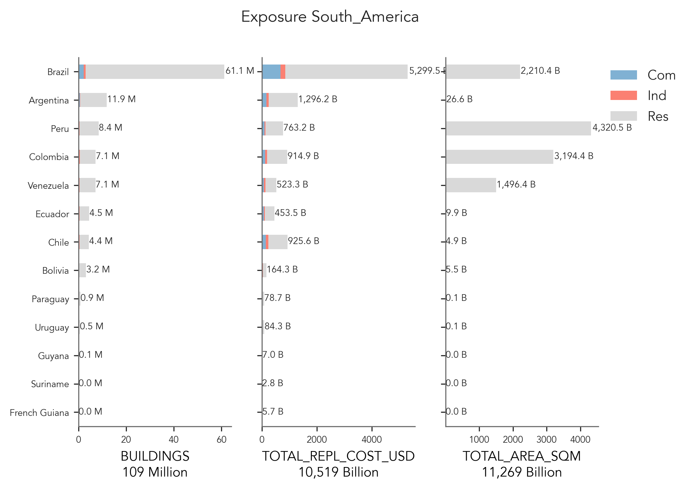
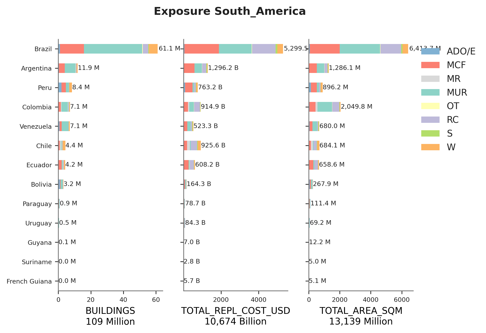

# South_America

## Metadata
|    | ID_0   | NAME_0        | OCCUPANCY   | DATA_YEAR   | PUBLISHER                                       | DATA_SOURCES                                |   ADMIN_LEVEL | SOURCE                                                                                                                              |
|---:|:-------|:--------------|:------------|:------------|:------------------------------------------------|:--------------------------------------------|--------------:|:------------------------------------------------------------------------------------------------------------------------------------|
|  0 | ARG    | Argentina     | RES         | 2010        | Instituto Nacional de Estadística y Censos      | Population and Housing Census               |             2 | https://www.indec.gob.ar/indec/web/Nivel4-Tema-2-41-135                                                                             |
|  1 | BOL    | Bolivia       | RES         | 2012        | Instituto Nacional de Estadística               | Population and Housing Census               |             3 | https://anda.ine.gob.bo/index.php/catalog/8                                                                                         |
|  2 | BRA    | Brazil        | RES         | 2010        | Instituto Brasileiro de Geografia e EstatÌstica | Population and Housing Census               |             2 | https://censo2010.ibge.gov.br/resultados.html                                                                                       |
|  3 | CHL    | Chile         | RES         | 2017        | Instituto Nacional de Estadística               | Population and Housing Census               |             4 | https://www.ine.gob.cl/estadisticas/sociales/censos-de-poblacion-y-vivienda/censo-de-poblacion-y-vivienda                           |
|  4 | COL    | Colombia      | RES         | 2018        | DANE                                            | Population and Housing Census               |             2 | https://microdatos.dane.gov.co/index.php/catalog/643/get_microdata                                                                  |
|  5 | ECU    | Ecuador       | RES         | 2010        | Instituto Nacional de Estadística y Censos      | Population and Housing Census               |             3 | https://www.ecuadorencifras.gob.ec/base-de-datos-censo-de-poblacion-y-vivienda/                                                     |
|  6 | GUF    | French Guiana | RES         | 2014        | GED4GEM                                         | GED4GEM                                     |             1 | GED4GEM                                                                                                                             |
|  7 | GUY    | Guyana        | RES         | 2012        | GED4GEM                                         | GED4GEM                                     |             1 | GED4GEM                                                                                                                             |
|  8 | PER    | Peru          | RES         | 2017        | Instituto Nacional de Estadística e Inform·tica | Population and Housing Census               |             3 | Redatam                                                                                                                             |
|  9 | PRY    | Paraguay      | RES         | 2012        | GED4GEM                                         | GED4GEM                                     |             1 | GED4GEM                                                                                                                             |
| 10 | SUR    | Suriname      | RES         | 2012        | GED4GEM                                         | GED4GEM                                     |             1 | GED4GEM                                                                                                                             |
| 11 | URY    | Uruguay       | RES         | 2011        | GED4GEM                                         | GED4GEM                                     |             1 | GED4GEM                                                                                                                             |
| 12 | VEN    | Venezuela     | RES         | 2011        | Instituto Nacional de Estadística               | Population and Housing Census               |             3 | Redatam                                                                                                                             |
| 13 | ARG    | Argentina     | IND, COM    | -           | Instituto Nacional de Estadística y Censos      | Censo Nacional económico                    |             1 | -                                                                                                                                   |
| 14 | BOL    | Bolivia       | IND, COM    | -           | Instituto Nacional de Estadística               | -                                           |             1 | -                                                                                                                                   |
| 15 | BRA    | Brazil        | IND, COM    | 2019        | Instituto Brasileiro de Geografia e Estatística | Cadastro Central do empresas                |             1 | https://www.ibge.gov.br/estatisticas/economicas/comercio/9016-estatisticas-do-cadastro-central-de-empresas.html?=&t=resultados      |
| 16 | CHL    | Chile         | IND, COM    | 2017        | Instituto Nacional de Estadística               | Directorio Nacional de Empresas 2017        |             1 | https://www.ine.gob.cl/herramientas/portal-de-mapas/geodatos-abiertos                                                               |
| 17 | COL    | Colombia      | IND, COM    | 2018        | DANE                                            | Geovisor Directorio EstadÌstico de Empresas |             1 | https://geoportal.dane.gov.co/geovisores/economia/directorio-estadistico-de-empresas/?lt=4.456007353293281&lg=-73.2781601239999&z=5 |
| 18 | ECU    | Ecuador       | IND, COM    | 2016        | Instituto Nacional de Estadística y Censos      | Directorio de Empresas - DIEE 2016          |             1 | https://www.ecuadorencifras.gob.ec/directorio-de-empresas-2016/                                                                     |
| 19 | GUF    | French Guiana | IND, COM    | -           | -                                               | -                                           |             1 | -                                                                                                                                   |
| 20 | GUY    | Guyana        | IND, COM    | -           | -                                               | -                                           |             1 | -                                                                                                                                   |
| 21 | PER    | Peru          | IND, COM    | 2015        | Instituto Nacional de Estadística e Informática | -                                           |             1 | http://censos.inei.gob.pe/cenec2008/tabulados/                                                                                      |
| 22 | PRY    | Paraguay      | IND, COM    | -           | -                                               | -                                           |             1 | -                                                                                                                                   |
| 23 | SUR    | Suriname      | IND, COM    | -           | -                                               | -                                           |             1 | -                                                                                                                                   |
| 24 | URY    | Uruguay       | IND, COM    | -           | -                                               | -                                           |             1 | -                                                                                                                                   |
| 25 | VEN    | Venezuela     | IND, COM    | 2008        | Instituto Nacional de Estadística               | IV censo económico 2007-2008                |             1 | http://www.ine.gov.ve/documentos/Economia/IVCensoEconomico/pdf/InformeIVCE.pdf                                                      |

    