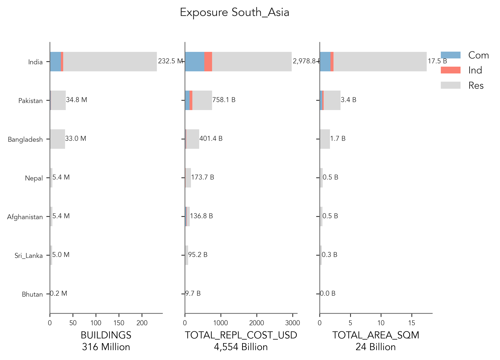
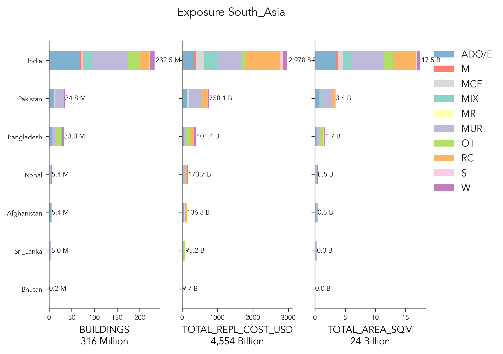

# South_Asia

## Metadata
|    | ID_0   | NAME_0      | OCCUPANCY   | DATA_SOURCES                                 | PUBLISHER                                                         | DATA_YEAR   |   ADM_LEVEL | VARIABLES                                                      | LINKS                                                                                                                                                           |
|---:|:-------|:------------|:------------|:---------------------------------------------|:------------------------------------------------------------------|:------------|------------:|:---------------------------------------------------------------|:----------------------------------------------------------------------------------------------------------------------------------------------------------------|
|  0 | AFG    | Afghanistan | RES         | Living Conditions Survey, 2016-17            | Islamic Republic of Afghanistan - Central Statistics Organization | 2017        |           1 | Population                                                     | https://reliefweb.int/report/afghanistan/afghanistan-living-conditions-survey-2016-17                                                                           |
|    |        |             |             | UN-HABITAT Afghanistan Housing Profile, 2017 |                                                                   |             |             | Housing units                                                  |                                                                                                                                                                 |
|    |        |             |             |                                              |                                                                   |             |             | Construction materials                                         |                                                                                                                                                                 |
|  1 | AFG    | Afghanistan | IND, COM    | Business Establishment Survey, 2015          | Islamic Republic of Afghanistan - Central Statistics Organization | 2015        |           1 | nan                                                            | http://documents.worldbank.org/curated/en/627621592297597797/Islamic-Republic-of-Afghanistan-Central-Statistics-Organization-Business-Establishment-Survey-2015 |
|  2 | BGD    | Bangladesh  | RES         | Population and Housing Census                | Bangladesh Bureau of Statistics                                   | 2011        |           2 | Type of dwelling                                               | http://203.112.218.69/binbgd/RpWebEngine.exe/Portal?BASE=HPC2011_long                                                                                           |
|    |        |             |             |                                              |                                                                   |             |             | Construction material of wall                                  |                                                                                                                                                                 |
|    |        |             |             |                                              |                                                                   |             |             | Construction material of roof                                  |                                                                                                                                                                 |
|    |        |             |             |                                              |                                                                   |             |             | Construction material of floor                                 |                                                                                                                                                                 |
|    |        |             |             |                                              |                                                                   |             |             | Type of area                                                   |                                                                                                                                                                 |
|    |        |             |             |                                              |                                                                   |             |             | Slum dwelling                                                  |                                                                                                                                                                 |
|  3 | BGD    | Bangladesh  | IND, COM    | Economic Census                              | Bangladesh Bureau of Statistics                                   | 2013        |           2 | Economic Activities                                            | http://203.112.218.65:8008/PageWebMenuContent.aspx?MenuKey=534                                                                                                  |
|  4 | BTN    | Bhutan      | RES         | Population and Housing Census                | National Statistics Bureau of Bhutan                              | 2017        |           2 | Material of wall                                               | http://www.nsb.gov.bt/publication/publications.php?id=2                                                                                                         |
|    |        |             |             |                                              |                                                                   |             |             | Material of floor                                              |                                                                                                                                                                 |
|    |        |             |             |                                              |                                                                   |             |             | Material of roof                                               |                                                                                                                                                                 |
|    |        |             |             |                                              |                                                                   |             |             | Type of area                                                   |                                                                                                                                                                 |
|  5 | BTN    | Bhutan      | IND, COM    | Establishment Census                         | Ministry of Labour and Human Resources                            | 2010        |           2 | Economic Activities                                            | http://www.molhr.gov.bt/molhr/wp-content/uploads/2017/07/Establishment-Census-Report-2010.pdf                                                                   |
|  6 | IND    | India       | RES         | 15th Census of India                         | Office of the Registrar General and Census Commissioner of India  | 2011        |           5 | Use of building                                                | https://censusindia.gov.in/census.website/data/census-tables                                                                                                    |
|    |        |             |             |                                              |                                                                   |             |             | Wall material                                                  |                                                                                                                                                                 |
|    |        |             |             |                                              |                                                                   |             |             | Floor material                                                 |                                                                                                                                                                 |
|    |        |             |             |                                              |                                                                   |             |             | Settlement type (urban / rural)                                |                                                                                                                                                                 |
|    |        |             |             |                                              |                                                                   |             |             | Slum dwellings                                                 |                                                                                                                                                                 |
|  7 | IND    | India       | IND, COM    | 15th Census of India                         | Office of the Registrar General and Census Commissioner of India  | 2011        |           3 | Use of building                                                | https://censusindia.gov.in/census.website/data/census-tables                                                                                                    |
|    |        |             |             |                                              |                                                                   |             |             | Wall material                                                  |                                                                                                                                                                 |
|    |        |             |             |                                              |                                                                   |             |             | Settlement type (urban / rural)                                |                                                                                                                                                                 |
|  8 | LKA    | Sri_Lanka   | RES         | Census of Population and Housing             | Department of Census and Statistics of Sri Lanka                  | 2012        |           2 | Type of housing structure                                      | http://www.statistics.gov.lk/PopHouSat/CPH2011/index.php?fileName=Activities/TentativelistofPublications                                                        |
|    |        |             |             |                                              |                                                                   |             |             | Material of wall                                               | http://www.statistics.gov.lk/PopHouSat/CPH2011/index.php?fileName=Finalhousing&gp=Activities&tpl=3                                                              |
|    |        |             |             |                                              |                                                                   |             |             | Material of floor                                              | Population: http://www.statistics.gov.lk/PopHouSat/CPH2011/index.php?fileName=P2&gp=Activities&tpl=3                                                            |
|    |        |             |             |                                              |                                                                   |             |             | Material of roof                                               |                                                                                                                                                                 |
|    |        |             |             |                                              |                                                                   |             |             | Possible info with year of construction (not available online) |                                                                                                                                                                 |
|  9 | LKA    | Sri_Lanka   | IND, COM    | Economic Census                              | Department of Census and Statistics of Sri Lanka                  | 2013-2014   |           2 | Economic Activities                                            | http://www.statistics.gov.lk/Economic/Economic%20Census.html                                                                                                    |
|    |        |             |             | Atlas of economic activities                 |                                                                   |             |             |                                                                |                                                                                                                                                                 |
| 10 | NPL    | Nepal       | RES         | National Population Census                   | Central Bureau of Statistics of Nepal                             | 2011        |           4 | Material of wall                                               | National Report Census 2011                                                                                                                                     |
|    |        |             |             |                                              |                                                                   |             |             |                                                                | http://cbs.gov.np/sectoral_statistics/population/wardlevel                                                                                                      |
| 11 | NPL    | Nepal       | IND, COM    | Nepal Labour Force Survey                    | Central Bureau of Statistics of Nepal                             | 2008        |           2 | Employed population by economic activity                       | http://cbs.gov.np/image/data/Surveys/2015/NLFS-2008%20Report.pdf                                                                                                |
| 12 | PAK    | Pakistan    | RES         | Population and Housing Census 2017           | Pakistan Bureau of Statistics (PBS)                               | 2017        |           1 | Population                                                     | https://www.pbs.gov.pk/content/final-results-census-2017-0                                                                                                      |
|    |        |             |             | World Housing Encyclopedia                   |                                                                   |             |             | Housing units                                                  |                                                                                                                                                                 |
|    |        |             |             |                                              |                                                                   |             |             | Construction materials                                         |                                                                                                                                                                 |
|    |        |             |             |                                              |                                                                   |             |             | Period of construction                                         |                                                                                                                                                                 |
| 13 | PAK    | Pakistan    | IND, COM    | Economic Survey 2020-21                      | Pakistan Bureau of Statistics (PBS)                               | 2021        |           1 | nan                                                            | https://www.pc.gov.pk/uploads/cpec/PES_2020_21.pdf                                                                                                              |

    